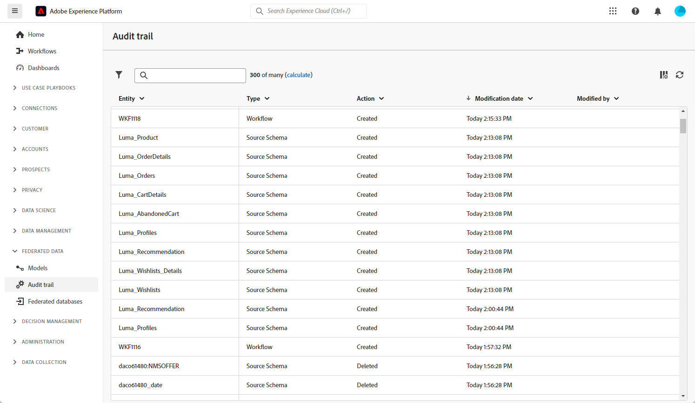

# Kom igång med granskningsspår {#audit-trail}

>[!CONTEXTUALHELP]
>id="dc_audit_trail"
>title="Granskningskedja"
>abstract="Funktionen för granskningsspår ger en detaljerad och kronologisk redovisning av alla åtgärder och händelser som har utförts i din miljö i realtid."

Funktionen för granskningsspår ger en detaljerad och kronologisk redovisning av alla åtgärder och händelser som har utförts i din miljö i realtid

Funktionen **[!UICONTROL Audit trail]** registrerar ständigt en detaljerad logg över åtgärder och händelser som inträffar i instansen av Adobe Federated Composition i realtid. Den erbjuder en praktisk metod för att få tillgång till en kronologisk datapost, som behandlar frågor som till exempel status för arbetsflöden, de senaste personerna att ändra dem eller aktiviteter som utförs av användare i instansen.

+++ Läs mer om tillgängliga enheter för granskningsspår

* **Source Schema-granskningsspår** gör att du kan övervaka aktiviteter och nyligen gjorda ändringar i dina scheman i Adobe Federated Audience Composition-instansen.

  Mer information om scheman finns på [sidan](../customer/schemas.md).

* **Arbetsflödets granskningsspår** gör att du kan hålla reda på aktiviteter och nyligen gjorda ändringar i arbetsflöden, inklusive deras aktuella tillstånd, som:

   * Starta
   * Pausa
   * Stoppa
   * Starta om
   * Rensning som motsvarar åtgärden Rensa historik
   * Simulera vilket motsvarar åtgärden Starta i simuleringsläge
   * Aktivering som är lika med åtgärden Kör väntande uppgifter nu
   * Ovillkorligt stopp

  Mer information om arbetsflöden finns på [sidan](../compositions/gs-compositions.md).

* Med **externt konto** kan du kontrollera ändringar som gjorts i externa konton i instansen Adobe Audience Composition.

  Mer information om externt konto finns på [sidan](../connections/federated-db.md).

+++

## Åtkomst till granskningsspår {#accessing-audit-trail}

Så här kommer du åt instansens **[!UICONTROL Audit trail]**:

1. Välj **[!UICONTROL Audit trail]** på menyn **[!UICONTROL Federated data]**.

1. Fönstret **[!UICONTROL Audit trail]** öppnas med listan över dina enheter. Adobe Campaign webbanvändargränssnitt granskar åtgärderna för att skapa, redigera och ta bort för arbetsflöden, alternativ, leveranser och scheman.

   

1. Fönstret **[!UICONTROL Audit entity]** ger dig mer detaljerad information om den valda entiteten, till exempel:

   * **[!UICONTROL Type]**: Arbetsflöde, alternativ, leveranser eller scheman.
   * **[!UICONTROL Entity]**: Intern namn på dina aktiviteter.
   * **[!UICONTROL Modified by]** : Användarnamn för den senaste personen som ändrade entiteten.
   * **[!UICONTROL Action]**: Senaste åtgärden som utfördes på den här entiteten, antingen Skapad, Ändrad eller Borttagen.
   * **[!UICONTROL Modification date]** : Datum för den senaste åtgärden som utfördes på entiteten.
