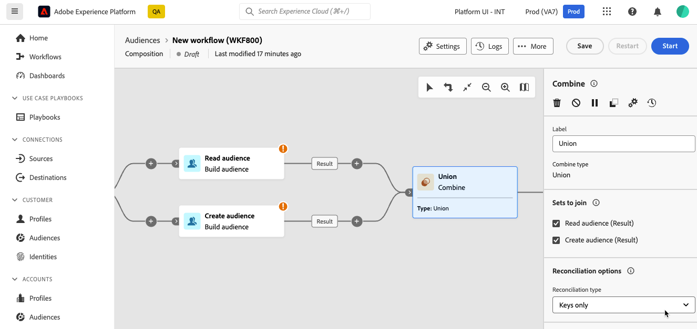

# Kombinera {#combine}

>[!CONTEXTUALHELP]
>id="dc_orchestration_combine"
>title="Kombinera aktivitet"
>abstract="Med aktiviteten **Kombinera** kan du utföra segmentering på den inkommande populationen. Du kan alltså kombinera flera populationer, exkludera delar av dem eller bara behålla data som är gemensamma för flera mål."

Med aktiviteten **Kombinera** kan du utföra segmentering på den inkommande populationen. Du kan alltså kombinera flera populationer, utesluta en del av dem eller bara behålla data som är gemensamma för flera mål.

Aktiviteten **Kombinera** kan placeras efter andra aktiviteter, men inte i början av kompositionen. Alla aktiviteter kan placeras efter **Kombinera**.

## Konfigurera Kombinera-aktiviteten {#combine-configuration}

>[!CONTEXTUALHELP]
>id="dc_orchestration_intersection_merging_options"
>title="Sammanfogningsalternativ för skärningar"
>abstract="Med **skärningspunkten** kan du bara behålla element som är gemensamma för de olika inkommande populationerna i aktiviteten. I avsnittet **Uppsättningar att gå med i** markerar du alla tidigare aktiviteter som du vill gå med i."

>[!CONTEXTUALHELP]
>id="dc_orchestration_exclusion_merging_options"
>title="Alternativ för uteslutningssammanslagning"
>abstract="Med **exkluderingen** kan du utesluta element från en population enligt vissa villkor. I avsnittet **Uppsättningar att gå med i** markerar du alla tidigare aktiviteter som du vill gå med i."

>[!CONTEXTUALHELP]
>id="dc_orchestration_combine_options"
>title="Välj segmenteringstyp"
>abstract="Välj hur du vill kombinera målgrupper: union, skärning eller uteslutning."

Följ de här vanliga stegen för att börja konfigurera aktiviteten **Kombinera**:

1. Lägg till flera aktiviteter för att bilda minst två olika körningsgrenar.

1. Lägg till en **Kombinera**-aktivitet i någon av de tidigare grenarna.

1. Välj segmenteringstyp: [Förening](#union), [Skärningspunkt](#intersection) eller [Uteslutning](#exclusion) och klicka på **Fortsätt**.

   

1. Markera alla tidigare aktiviteter som du vill ansluta till i avsnittet **Uppsättningar att ansluta till**.

## Sammanslutning {#combine-union}

>[!CONTEXTUALHELP]
>id="dc_orchestration_intersection_reconciliation_options"
>title="Avstämningsalternativ för skärningar"
>abstract="Välj avstämningstypen för att definiera hur dubbletter hanteras."

>[!CONTEXTUALHELP]
>id="dc_orchestration_combine_reconciliation"
>title="Avstämningsalternativ"
>abstract="Välj **Avstämningstypen** för att definiera hur dubbletter ska hanteras."

I aktiviteten **Kombinera** kan du konfigurera en **union**.

För detta måste du välja **avstämningstypen** för att definiera hur dubbletter hanteras:

* **Endast tangenter**: Detta är standardläget. Aktiviteten behåller endast ett element när element från olika inkommande övergångar har samma nyckel.  Detta alternativ kan endast användas om de inkommande populationerna är homogena.
* **Ett urval kolumner**: välj det här alternativet om du vill definiera listan med kolumner som datavstämningen ska användas på. Du måste först markera den primära uppsättningen (som innehåller källdata) och sedan de kolumner som ska användas för kopplingen.

## Skärningspunkt {#combine-intersection}

I aktiviteten **Kombinera** kan du konfigurera en **skärning**.

För detta följer du de extra stegen nedan:

1. Välj **Avstämningstypen** för att definiera hur dubbletter hanteras. Se avsnittet [Förena](#union).
1. Du kan kontrollera alternativet **Generera komplement** om du vill bearbeta den återstående populationen. Komplementet ska innehålla en kombination av resultaten av alla inkommande aktiviteter minus skärningspunkten. En ytterligare utgående övergång läggs sedan till i aktiviteten.

## Uteslutning {#combine-exclusion}

>[!CONTEXTUALHELP]
>id="dc_orchestration_exclusion_options"
>title="Uteslutningsregler"
>abstract="Vid behov kan du ändra inkommande tabeller. Om du vill utesluta ett mål från ett annat schema, som också kallas måldimension, måste det här målet återställas till samma schema som huvudmålet. Det gör du genom att klicka på **Lägg till en regel** i avsnittet E **xklusionsregler** och ange villkoren för schemaändring. Datavstämning utförs antingen via ett attribut eller en koppling."

>[!CONTEXTUALHELP]
>id="dc_orchestration_combine_sets"
>title="Markera uppsättningar som ska kombineras"
>abstract="I avsnittet **Uppsättningar att gå med i** väljer du den **primära uppsättningen** bland de inkommande övergångarna. Detta är den uppsättning från vilken element utesluts. De andra uppsättningarna matchar element innan de utesluts från den primära uppsättningen."

>[!CONTEXTUALHELP]
>id="dc_orchestration_combine_exclusion"
>title="Uteslutningsregler"
>abstract="Vid behov kan du ändra inkommande tabeller. Om du vill utesluta ett mål från ett annat schema, som också kallas måldimension, måste det här målet återställas till samma schema som huvudmålet. Det gör du genom att klicka på **Lägg till en regel** i avsnittet **Uteslutningsregler** och ange villkoren för schemaändring. Datavstämning utförs antingen via ett attribut eller en koppling."

>[!CONTEXTUALHELP]
>id="dc_orchestration_combine_complement"
>title="Kombinera skapa komplementfärger"
>abstract="Växla till alternativet **Generera komplement** om du vill bearbeta den återstående populationen i en ytterligare övergång."

I aktiviteten **Kombinera** kan du konfigurera ett **undantag**.

För detta behöver du följa de extra stegen nedan:

1. I avsnittet **Uppsättningar att gå med i** väljer du den **primära uppsättningen** bland de inkommande övergångarna. Detta är den uppsättning från vilken element utesluts. De andra uppsättningarna matchar element innan de utesluts från den primära uppsättningen.

1. Vid behov kan du ändra inkommande tabeller. Om du vill utesluta ett mål från ett annat schema måste det här målet återställas till samma schema som huvudmålet. Det gör du genom att klicka på **Lägg till en regel** i avsnittet **Uteslutningsregler** och ange villkoren för schemaändring. Datavstämning utförs antingen via ett attribut eller en koppling. <!-- pas compris-->
1. Du kan kontrollera alternativet **Generera slutförande** om du vill bearbeta den återstående fyllningen. Se avsnittet [Skärningspunkt](#intersection).

<!--
## Examples{#combine-examples}

In the following example, we are using a **Combine** activity and we add a **union** to retrieves all the profiles of the two queries: persons between 18 and 27 years old and persons between 34 and 40 years old.

The following example shows the **intersection** between two query activities. It is being used here to retrieve profiles who are between 18 to 27 years old and whose email address has been provided.

The following **exclusion** example shows two queries configured to filter profiles who are between 18 and 27 years old and have an Adobe email domain. The profiles with an Adobe email domain are then excluded from the first set. 

-->
