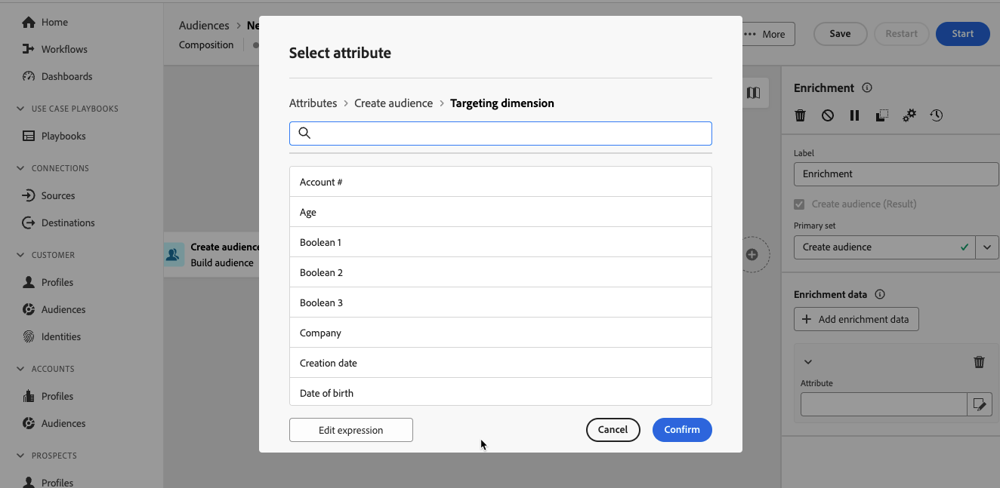

# Berikning {#enrichment}

>[!CONTEXTUALHELP]
>id="dc_orchestration_enrichment"
>title="Anrikningsaktivitet"
>abstract="The **Berikning** kan du förbättra måldata med ytterligare information från databasen. Den används ofta i en komposition efter segmenteringsaktiviteter."

>[!CONTEXTUALHELP]
>id="dc_orchestration_enrichment_data"
>title="Anrikningsaktivitet"
>abstract="När berikningsdata har lagts till i sammansättningen kan de användas i aktiviteter som lagts till efter **Berikning** -aktivitet för att segmentera profiler i olika grupper baserat på deras beteenden, inställningar och val."

>[!CONTEXTUALHELP]
>id="dc_orchestration_enrichment_simplejoin"
>title="Länkdefinition"
>abstract="Skapa en länk mellan data i arbetstabellen och den federerade databasen."

>[!CONTEXTUALHELP]
>id="dc_orchestration_enrichment_reconciliation"
>title="Anrikningsavstämning"
>abstract="Ange avstämningsparametrarna."

>[!CONTEXTUALHELP]
>id="dc_targetdata_personalization_enrichmentdata"
>title="Anrikningsdata"
>abstract="Välj de data som ska användas för att berika kompositionen. Du kan välja två typer av anrikningsdata: ett enskilt anrikningsattribut från måldimensionen, eller en samlingslänk, som är en länk med en 1-N-kardinalitet mellan tabellerna."

The **Berikning** kan du förbättra måldata med ytterligare information från den federerade databasen. Den används ofta i kompositioner efter segmenteringsaktiviteter.

Anrikningsdata kan komma antingen:

* **Från samma arbetsregister** som den som är inriktad på din komposition:

  *Ange en grupp kunder som målgrupp och lägg till fältet&quot;Födelsedatum&quot; i den aktuella arbetsregistret*.

* **Från en annan arbetstabell**:

  *Ange kunder som målgrupp och lägg till fälten&quot;Belopp&quot; och&quot;Typ av produkt&quot; från tabellen&quot;Inköp&quot;*.

När anrikningsdata har lagts till i sammansättningen kan de användas i aktiviteter som lagts till efter **Berikning** aktiviteter för att segmentera kunder i olika grupper baserat på deras beteenden, preferenser och val.

<!--For instance, you can add to the working table information related to customers' purchases and use this data to personalize emails with their latest purchase or the amount spent on these purchases.-->

## Konfigurera anrikningsaktiviteten {#enrichment-configuration}

Följ de här stegen för att konfigurera **Berikning** aktivitet:

1. Lägg till aktiviteter som **Bygg målgrupper** och **Kombinera** verksamhet.
1. Lägg till en **Berikning** aktivitet.

   

1. Om flera övergångar har konfigurerats i din komposition kan du använda **[!UICONTROL Primary set]** -fält för att definiera vilken övergång som ska användas som primär uppsättning för att berika med data.

1. Klicka **Lägg till anrikningsdata** och välj det attribut som ska användas för att förbättra data.

   

   >[!NOTE]
   >
   >The **Redigera uttrycksknapp** på skärmen för attributval kan du skapa avancerade uttryck för att välja attributet.

<!--PAS VU SUR INSTANCE: You can select two types of enrichment data: a single enrichment attribute from the target dimension, or a collection link. Each of these types is detailed in the examples below:

    * [Single enrichment attribute](#single-attribute)
    * [Collection lnk](#collection-link)-->

## Exempel {#example}

### Single enrichment-attribut {#single-attribute}

Här lägger vi bara till ett enda anrikningsattribut, till exempel födelsedatumet. Följ de här stegen:

1. Klicka inuti **Attribut** fält.
1. Välj ett enkelt fält från målgruppsdimensionen, födelsedatumet i vårt exempel.
1. Klicka **Bekräfta**.

<!--### Collection link {#collection-link}

In this more complex use case, we will select a collection link which is a link with a 1-N cardinality between tables. Let's retrieve the three latest purchases that are less than 100$. For this you need to define:

* an enrichment attribute: the **Total amount** field
* the number of lines to retrieve: 3
* a filter: filter out items that are greater than 100$
* a sorting: descendant sorting on the **Order date** field. 

#### Add the attribute {#add-attribute}

This is where you select the collection link to use as enrichment data.

1. Click inside the **Attribute** field.
1. Click **Display advanced attributes**.
1. Select the **Total amount** field from the **Purchases** table. 

#### Define the collection settings{#collection-settings}

Then, define how the data is collected and the number of records to retrieve.

1. Select **Collect data** in the **Select how the data is collected** drop-down.
1. Type "3" in the **Lines to retrieve (Columns to create)** field. 

If you want, for example, to get the average amount of purchases for a customer, select **Aggregated data** instead, and select **Average** in the **Aggregate function** drop-down.

#### Define the filters{#collection-filters}

Here, we define the maximum value for the enrichment attribute. We filter out items that are greater than 100$. [Learn how to work with the query modeler](../../query/query-modeler-overview.md)

1. Click **Edit filters**.
1. Add the two following filters: **Total amount** exists AND **Total amount** is less than 100. The first one filters NULL values as they would appear as the greatest value.
1. Click **Confirm**.

#### Define the sorting{#collection-sorting}

We now need to apply sorting in order to retrieve the three **latest** purchases.

1. Activate the **Enable sorting** option.
1. Click inside the **Attribute** field.
1. Select the **Order date** field.
1. Click **Confirm**. 
1. Select **Descending** from the **Sort** drop-down.-->
