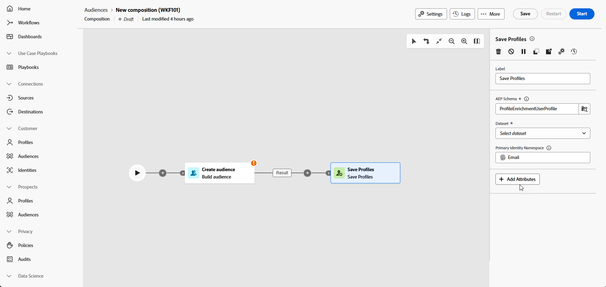

# Spara profiler {#save-profile}

>[!CONTEXTUALHELP]
>id="dc_orchestration_saveprofile"
>title="Spara profiler"
>abstract="Med aktiviteten Spara profiler kan du berika Experience Platform-profiler genom att federera data från externa lagerställen så att du kan förbättra kundprofiler med ytterligare attribut. "

>[!CONTEXTUALHELP]
>id="dc_orchestration_saveprofile_aepschemalist"
>title="Välj Experience Platform-schema"
>abstract="Välj Experience Platform-schema för profilerna."

>[!CONTEXTUALHELP]
>id="dc_orchestration_saveprofile_primaryidentitynamespace"
>title="Välj fältet Primär identifierare"
>abstract="Välj den primära identitet som ska användas för att identifiera målprofilerna i databasen."

>[!CONTEXTUALHELP]
>id="dc_orchestration_saveprofile_selectaepschema"
>title="Välj Experience Platform-schema"
>abstract="Välj Experience Platform-schema för profilerna."

>[!CONTEXTUALHELP]
>id="dc_orchestration_saveprofile_updatemode"
>title="Spara profiluppdateringsläge"
>abstract="De tillgängliga uppdateringslägena för aktiviteten Spara profil omfattar fullständig uppdatering och inkrementell uppdatering."

>[!CONTEXTUALHELP]
>id="dc_orchestration_saveprofile_updatemode_full"
>title="Fullständig uppdatering"
>abstract="Det fullständiga uppdateringsläget uppdaterar hela uppsättningen profiler för berikning."

>[!CONTEXTUALHELP]
>id="dc_orchestration_saveprofile_updatemode_incremental"
>title="Inkrementell uppdatering"
>abstract="Det stegvisa uppdateringsläget uppdaterar de profiler som har ändrats sedan den senaste berikningen kördes."

>[!CONTEXTUALHELP]
>id="dc_orchestration_saveprofile_primaryidentityfield"
>title="Primärt identitetsfält"
>abstract="Det primära identitetsfältet anger källan till sanningen när profiler slås samman för berikning."

>[!CONTEXTUALHELP]
>id="dc_orchestration_saveprofile_requiredfieldscheck"
>title="Kriterier för obligatoriska fält"
>abstract="Ett obligatoriskt fält är ett attribut som måste fyllas i för varje profil eller post när data exporteras. Om ett obligatoriskt fält saknas kommer exporten inte att vara fullständig eller giltig."

>[!CONTEXTUALHELP]
>id="dc_orchestration_saveprofile_primaryidentitycheck"
>title="Kriterier för primärt identitetsfält"
>abstract="Unik identifierare för varje profil eller post. Detta säkerställer att alla poster kan identifieras och matchas på ett distinkt sätt, vilket förhindrar att data dupliceras."

Med aktiviteten **Spara profiler** kan du berika Adobe Experience Platform-profiler med data från externa lagerställen.

Den här aktiviteten används vanligtvis för att förbättra kundprofiler genom att lägga in ytterligare attribut och insikter utan att flytta eller duplicera data till plattformen fysiskt.

## Konfigurera aktiviteten Spara profiler {#save-profile-configuration}

Så här konfigurerar du aktiviteten **Spara profiler**:

1. Lägg till en **Spara profiler**-aktivitet i kompositionen.

   

1. Ange etiketten för profilerna som ska skapas.

   >[!IMPORTANT]
   >
   >Målgruppsetiketten måste vara unik i den aktuella sandlådan. Det kan inte vara samma etikett som någon befintlig målgrupp.

1. Markera det Adobe Experience Platform-schema som du vill använda.

   

1. Välj det primära identitetsfältet som ska användas för att identifiera profiler i databasen.

1. Om du vill stämma av ytterligare dataattribut klickar du på **Lägg till attribut**.

   Ange sedan fältet **Source** (externa data) och fältet **Mål** (schemafält) för varje attribut som du vill mappa.

   

1. När konfigurationen är klar klickar du på **Start**.
