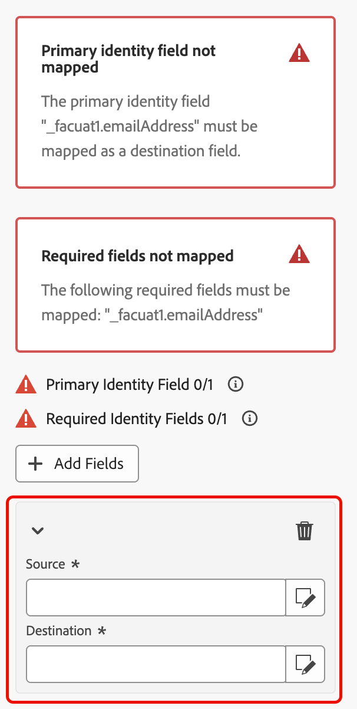
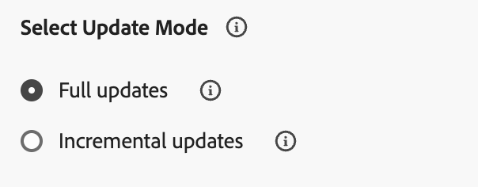

# Spara profiler {#save-profile}

>[!CONTEXTUALHELP]
>id="dc_orchestration_saveprofile"
>title="Spara profiler"
>abstract="Med aktiviteten Spara profiler kan du berika Experience Platform-profiler genom att federera data från externa lagerställen så att du kan förbättra kundprofiler med ytterligare attribut. "

>[!CONTEXTUALHELP]
>id="dc_orchestration_saveprofile_aepschemalist"
>title="Välj Experience Platform-schema"
>abstract="Välj Experience Platform-schema för profilerna."

>[!CONTEXTUALHELP]
>id="dc_orchestration_saveprofile_primaryidentitynamespace"
>title="Välj fältet Primär identifierare"
>abstract="Välj den primära identitet som ska användas för att identifiera målprofilerna i databasen."

>[!CONTEXTUALHELP]
>id="dc_orchestration_saveprofile_selectaepschema"
>title="Välj Experience Platform-schema"
>abstract="Välj Experience Platform-schema för profilerna."

>[!CONTEXTUALHELP]
>id="dc_orchestration_saveprofile_updatemode"
>title="Spara profiluppdateringsläge"
>abstract="De tillgängliga uppdateringslägena för aktiviteten Spara profil omfattar fullständig uppdatering och inkrementell uppdatering."

>[!CONTEXTUALHELP]
>id="dc_orchestration_saveprofile_updatemode_full"
>title="Fullständig uppdatering"
>abstract="Det fullständiga uppdateringsläget uppdaterar hela uppsättningen profiler för berikning."

>[!CONTEXTUALHELP]
>id="dc_orchestration_saveprofile_updatemode_incremental"
>title="Inkrementell uppdatering"
>abstract="Det stegvisa uppdateringsläget uppdaterar de profiler som har ändrats sedan den senaste berikningen kördes."

>[!CONTEXTUALHELP]
>id="dc_orchestration_saveprofile_primaryidentityfield"
>title="Primärt identitetsfält"
>abstract="Det primära identitetsfältet anger källan till sanningen när profiler slås samman för berikning."

>[!CONTEXTUALHELP]
>id="dc_orchestration_saveprofile_requiredfieldscheck"
>title="Kriterier för obligatoriska fält"
>abstract="Ett obligatoriskt fält är ett attribut som måste fyllas i för varje profil eller post när data exporteras. Om ett obligatoriskt fält saknas kommer exporten inte att vara fullständig eller giltig."

>[!CONTEXTUALHELP]
>id="dc_orchestration_saveprofile_primaryidentitycheck"
>title="Kriterier för primärt identitetsfält"
>abstract="Unik identifierare för varje profil eller post. Detta säkerställer att alla poster kan identifieras och matchas på ett distinkt sätt, vilket förhindrar att data dupliceras."

Med aktiviteten **[!UICONTROL Save Profiles]** kan du berika Adobe Experience Platform-profiler med data från externa lagerställen.

Den här aktiviteten används vanligtvis för att förbättra kundprofiler genom att lägga in ytterligare attribut och insikter utan att flytta eller duplicera data till plattformen fysiskt.

## Konfigurera aktiviteten [!UICONTROL Save Profiles] {#save-profile-configuration}

>[!IMPORTANT]
>
>Aktiviteten **Spara profiler** kräver ett profilaktiverat schema och en datauppsättning. Läs användarhandboken för [datauppsättningen](https://experienceleague.adobe.com/en/docs/experience-platform/catalog/datasets/user-guide#enable-profile){target="_blank"} om du vill lära dig hur du aktiverar din datauppsättning som profilaktiverad.
>
>Om den markerade datauppsättningen **inte** har upsert aktiverat kommer data från profilerna att **ersättas**. Läs [Aktivera uppdateringsguiden](https://experienceleague.adobe.com/en/docs/experience-platform/catalog/datasets/enable-upsert) om du vill lära dig hur du aktiverar upsert för dina datauppsättningar.

Så här konfigurerar du aktiviteten **[!UICONTROL Save Profiles]**:

1. Lägg till en **[!UICONTROL Save Profiles]**-aktivitet i din komposition.

   {width="1500" zoomable="yes"}

1. Ange etiketten för profilerna som ska skapas.

   >[!IMPORTANT]
   >
   >Målgruppsetiketten måste vara unik i den aktuella sandlådan. Det kan inte vara samma etikett som någon befintlig målgrupp.

1. Markera det Adobe Experience Platform-schema som du vill använda.

   {width="1500" zoomable="yes"}

1. Välj den datauppsättning som du vill spara anrikningen i.

   {width="300" zoomable="yes"}

1. När du har valt datauppsättningen kan du se det primära identitetsfältet som kommer att användas för att identifiera profiler i databasen.

1. Välj **[!UICONTROL Add Fields]** om du vill lägga till primära och obligatoriska identitetsfält.

   {width="300" zoomable="yes"}

   Du kan ange fältet **Source** (externa data) och fältet **Mål** (schemafält) för varje attribut som du vill mappa.

   {width="300" zoomable="yes"}

1. Du kan också ange uppdateringsläget för anrikningen.

   {width="300" zoomable="yes"}

   | Uppdateringsläge | Beskrivning |
   | ----------- | ----------- |
   | Fullständiga uppdateringar | Den fullständiga uppsättningen profiler uppdateras för att berika. |
   | Inkrementella uppdateringar | Endast profiler som har ändrats sedan den senaste berikningen uppdaterades för anrikningen. |

   Om du väljer [!UICONTROL Incremental updates] måste du också välja det senast ändrade datumet för att avgöra vilka data som skickas.

1. Välj **Start** när konfigurationen är klar.
