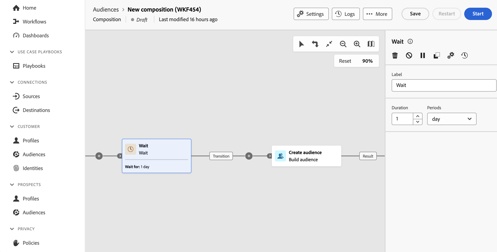

# Vänta {#wait}

>[!CONTEXTUALHELP]
>id="dc_orchestration_wait"
>title="Vänta på aktivitet"
>abstract="Aktiviteten **Wait** används för att fördröja övergången från en aktivitet till en annan."

Aktiviteten **Wait** tillåter en viss tid mellan två aktiviteter som körs.

## Konfiguration{#wait-configuration}

Följ de här stegen för att konfigurera aktiviteten **Wait**:

1. Lägg till en **Vänta**-aktivitet i kompositionen.

1. Ange **Varaktighet** för väntetiden mellan inkommande och utgående övergångar.

1. Välj tidsenhet i fältet **Perioder**: sekunder, minuter, timmar, dagar.

   
