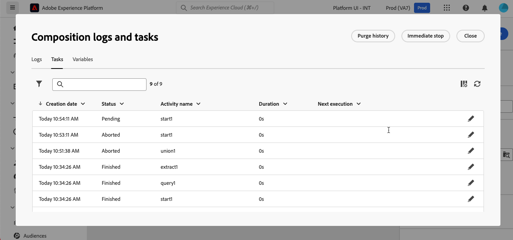

# Skapa en komposition

Med Federated Audience Composition kan du skapa kompositioner där du kan använda olika aktiviteter i en visuell arbetsyta för att skapa målgrupper. När du har skapat din komposition sparas målgrupperna i Adobe Experience Platform och kan utnyttjas till Experience Platform destinationer och Adobe Journey Optimizer för att nå ut till kunderna.

## Definiera din komposition {#create}

>[!CONTEXTUALHELP]
>id="dc_composition_creation_properties"
>title="Kompositionsegenskaper"
>abstract="På den här skärmen väljer du den mall som ska användas för att skapa kompositionen och anger en etikett. Expandera sektionen Ytterligare OPTIONS om du vill konfigurera fler inställningar, till exempel kompositionens interna namn, mapp, tidszon och övervakningsgrupp. Vi rekommenderar starkt att du väljer en grupp för ansvariga så att de får ett meddelande om ett fel inträffar."

Om du vill skapa en komposition måste du först definiera dess etikett och eventuellt konfigurera ytterligare inställningar.

Om du vill skapa en komposition väljer du **[!UICONTROL Audiences]** i avsnittet **[!UICONTROL Customer]** följt av fliken **[!UICONTROL Federated compositions]**.

Bläddringssidan för federerade kompositioner visas. Välj **[!UICONTROL Create composition]** om du vill fortsätta med skapandet av kompositionen.

I avsnittet **[!UICONTROL Properties]** anger du en etikett för kompositionen och väljer en datamodell. Endast scheman som är kopplade till den här datamodellen är tillgängliga i dispositionens aktiviteter.

Välj **[!UICONTROL Create]**.  Dispositionsarbetsytan visas. Nu kan du konfigurera kompositionen genom att lägga till aktiviteter och övergångar på arbetsytan.

## Arbetsyta {#canvas}

Överst på arbetsytan finns ett verktygsfält med alternativ för att hantera och navigera i dina aktiviteter.

Tillgängliga alternativ är:

* **[!UICONTROL Multiple selection]**: Markera flera aktiviteter om du vill ta bort alla samtidigt eller kopiera och klistra in dem.
* **[!UICONTROL Rotate]**: Växla arbetsytan så att den visas lodrätt.
* **[!UICONTROL Fit to screen]**: Justera arbetsytans zoomnivå till skärmen.
* **[!UICONTROL Zoom in]** / **[!UICONTROL Zoom out]**: Zooma in eller ut från arbetsytan.
* **[!UICONTROL Display map]**: Öppnar en ögonblicksbild av arbetsytan som visar att du finns.

## Lägg till aktiviteter {#add-activities}

På arbetsytan kan du lägga till aktiviteter och övergångar som hjälper dig att definiera målgruppen. Med aktiviteter kan du *definiera* komponenterna i målgruppen medan övergångar gör att du kan *organisera* flödet i din komposition.

Mer information om aktiviteter och övergångar som är tillgängliga för användning finns i [aktivitetsöversikt](./activities.md).

## Hantera aktiviteter {#manage-activities}

Du kan utföra åtgärder på dina tillagda aktiviteter i egenskapsfönstret.

Alternativen är:

* **[!UICONTROL Delete]**: Ta bort aktiviteten från arbetsytan.
* **[!UICONTROL Disable]/[!UICONTROL Enable]**: Inaktivera eller aktivera aktiviteten. När kompositionen körs utförs inte inaktiverade aktiviteter och följande aktiviteter på samma sökväg och kompositionen stoppas.
* **[!UICONTROL Pause]/[!UICONTROL Resume]**: Pausa eller återuppta aktiviteten. När kompositionen körs pausas den vid den pausade aktiviteten. Motsvarande uppgift och alla som följer den i samma sökväg körs inte.
* **[!UICONTROL Copy]**: Kopierar aktiviteten för att klistra in den på en annan plats i kompositionen. Det gör du genom att markera knappen **+** för en övergång och välja **[!UICONTROL Paste X activity]**. <!-- cannot copy multiple activities ? cannot paste in another composition?-->
* Konfigurera **[!UICONTROL Execution options]** för den valda aktiviteten. Följande körningsalternativ är tillgängliga:
  +++Tillgängliga körningsalternativ

  I avsnittet **[!UICONTROL Properties]** kan du konfigurera allmänna inställningar för aktivitetens körning:

   * **[!UICONTROL Execution]**: Definiera åtgärden som ska utföras när programmet startas.
   * **[!UICONTROL Maximum execution duration]**: Ange en varaktighet som 30s eller 1h. Om aktiviteten inte är klar efter att den angivna tiden har gått ut utlöses en varning. Detta påverkar inte hur kompositionen fungerar.
   * **[!UICONTROL Time zone]**: Välj aktivitetens tidszon. Med Federated Audience Composition kan du hantera tidsskillnader mellan flera länder i samma instans. Inställningen som används konfigureras när instansen skapas.
   * **[!UICONTROL Affinity]**: Tvinga kompositionsaktiviteten att köras på en viss dator. För att kunna göra detta måste du ange en eller flera tillhörigheter för aktiviteten i fråga.
   * **[!UICONTROL Behavior]**: Definiera proceduren som ska följas om asynkrona uppgifter används.

  I avsnittet **[!UICONTROL Error management]** kan du ange vilken åtgärd som ska utföras om aktiviteten stöter på ett fel.

  I avsnittet **[!UICONTROL Initialization script]** kan du initiera variabler eller ändra aktivitetsegenskaper. Markera knappen **[!UICONTROL Edit code]** och skriv det kodfragment som ska köras. Skriptet anropas när aktiviteten körs.

  +++
* **Loggar och uppgifter**: Visa loggar och uppgifter för den valda aktiviteten.

## Starta och övervaka kompositionen {#start-and-monitor}

När du är klar med att lägga till aktiviteter i kompositionen kan du starta kompositionens körning. Om du vill starta en komposition väljer du knappen **[!UICONTROL Start]** i skärmens övre högra hörn.

| Åtgärd | Beskrivning |
| ------ | ----------- |
| **Start** | Startar kompositionens körning och flyttar den till statusen **Pågår**. |
| **Paus** | Pausar körningen av kompositionen och ställer in den till statusen **Pausad**. Inga nya aktiviteter aktiveras förrän kompositionen återupptas, men pågående åtgärder **inte** pausas. |
| **Fortsätt** | Återupptar körningen av den pausade kompositionen och ställer in den till statusen **Pågår**. |
| **Stoppa** | Stoppar kompositionens körning och ställer in den till läget **Slutförd**. Du **kan inte** återuppta kompositionen från samma plats som den stoppades från. |
| **Starta om** | Stoppar och startar om kompositionens körning. |

När kompositionen körs utförs varje aktivitet på arbetsytan i sekventiell ordning tills kompositionen är klar. Du kan spåra förloppet för målprofiler i realtid med ett visuellt flöde. På så sätt kan du snabbt identifiera status för varje aktivitet och antalet profiler som övergår mellan dem.

De visuella indikatorerna i det övre högra hörnet av varje aktivitet visar körningens status:

| Visuell indikator | Beskrivning |
| ---------------- | ------------|
| {zoomable="yes"}{width="70%"} | Aktiviteten körs för närvarande. |
| {zoomable="yes"}{width="70%"} | Aktiviteten kräver din uppmärksamhet. Detta kan inbegripa att bekräfta leveransen eller vidta nödvändiga åtgärder. |
| {zoomable="yes"}{width="70%"} | Aktiviteten har påträffat ett fel. Lös problemet genom att öppna dispositionsloggarna för mer information. |
| {zoomable="yes"}{width="70%"} | Aktiviteten har körts. |

### Övervaka loggar och uppgifter {#monitor-logs}

Dessutom kan du visa kompositionsloggarna för att vara säker på att de körs som de ska. Välj **[!UICONTROL Logs]** i åtgärdsverktygsfältet om du vill visa den här informationen.

Skärmen **[!UICONTROL Composition logs and tasks]** visas. Här finns en historik över dispositionskörningen, där alla användaråtgärder och påträffade fel registreras.

Historien är ordnad på flera flikar, som beskrivs nedan:

* Fliken **[!UICONTROL Log]** innehåller körningshistoriken för alla dispositionsaktiviteter. Den indexerar de åtgärder som utförts och körningsfel i kronologisk ordning.
* Fliken **[!UICONTROL Tasks]** innehåller information om körningssekvensen för aktiviteterna. Med knappen som finns i slutet av varje uppgift kan du visa de händelsevariabler som skickats genom aktiviteten.
* Fliken **[!UICONTROL Variables]** visar alla variabler som skickats i kompositionen. Det är endast tillgängligt när du får åtkomst till loggar och uppgifter från dispositionsarbetsytan. Det är nu tillgängligt när du öppnar loggarna från en aktivitets egenskapspanel.

På alla flikar kan du välja vilka kolumner som ska visas och i vilken ordning de ska visas, tillämpa filter och använda sökfältet för att snabbt hitta önskad information.

### Prenumerera på aviseringar {#alerts}

Du kan också prenumerera på aviseringar för att få meddelanden om att din federerade komposition har slutförts eller misslyckats.

Om du vill prenumerera på aviseringar väljer du  följt av .

{zoomable="yes"}{width="70%"}

Sidan med meddelandeinställningar visas. På den här sidan markerar du **[!UICONTROL Experience Platform]** och väljer de aviseringskanaler du vill använda. Välj **[!UICONTROL In-app]** om du vill visa meddelanden i användargränssnittet.

{zoomable="yes"}{width="50%"}

När **[!UICONTROL In-app]** är markerat får du nu ett meddelande om slutförda och misslyckade dispositioner.

{zoomable="yes"}{width="70%"}

## Konfigurera kompositionens inställningar {#settings}

>[!CONTEXTUALHELP]
>id="dc_composition_settings_properties"
>title="Kompositionsegenskaper"
>abstract="Det här avsnittet innehåller generiska kompositionsegenskaper som också är tillgängliga när du skapar kompositionen."

>[!CONTEXTUALHELP]
>id="dc_composition_settings_segmentation"
>title="Dispositionssegmentering"
>abstract="Som standard behålls endast arbetstabellerna för den senaste körningen av kompositionen. Du kan aktivera det här alternativet om du vill behålla arbetsregister för testning. Den får bara användas **endast** i utvecklings- eller mellanlagringsmiljöer. Den får aldrig kontrolleras i en produktionsmiljö."

>[!CONTEXTUALHELP]
>id="dc_composition_settings_error"
>title="Inställningar för felhantering"
>abstract="I det här avsnittet kan du definiera hur fel ska hanteras under körningen. Du kan välja att pausa processen, ignorera ett visst antal fel eller avbryta kompositionskörningen."

När du öppnar en komposition kan du komma åt avancerade inställningar som t.ex. gör att du kan definiera hur kompositionen ska fungera om fel uppstår.

Om du vill komma åt de här ytterligare alternativen väljer du **[!UICONTROL Settings]** i det övre avsnittet på skärmen där kompositionen skapas.

| Inställningar | Beskrivning |
| -------- | ----------- |
| **[!UICONTROL Label]** | Uppdatera det namn som har angetts för kompositionen. |
| **[!UICONTROL Keep the result of interim populations between two executions]** | Om det här alternativet är aktiverat behålls arbetsregister även efter att kompositionen har utförts. Som standard behålls endast arbetstabellerna för den senaste körningen av kompositionen. Arbetstabeller från tidigare körningar tas bort dagligen. Du bör bara aktivera den här inställningen i en utvecklings- eller staging-miljö. Du bör **aldrig** aktivera den här inställningen i en produktionsmiljö. |
| **[!UICONTROL Error management]** | Definierar de åtgärder som vidtas om kompositionen har ett fel. Det finns tre möjliga alternativ: <ul><li>**[!UICONTROL Suspend the process]**: Kompositionen pausas automatiskt och dess status ändras till **[!UICONTROL Failed]**. När problemet är löst kan du återuppta kompositionen med **[!UICONTROL Resume]**-knapparna.</li><li>**[!UICONTROL Ignore]**: Statusen för aktiviteten som utlöste felet ändras till **[!UICONTROL Failed]**, men dispositionen behåller statusen **[!UICONTROL Started]**.</li><li>**[!UICONTROL Abort the process]**: Kompositionen stoppas automatiskt och dess status ändras till **[!UICONTROL Failed]**. När problemet är löst startar du om kompositionen med knappen **[!UICONTROL Start]**.</li></ul> |
| **[!UICONTROL Consecutive errors]** | Ange antalet fel som kan ignoreras innan processen stoppas. När det här numret har nåtts ändras dispositionsstatusen till **[!UICONTROL Failed]**. Om värdet för det här fältet är 0 stoppas aldrig kompositionen oavsett antalet fel. |
