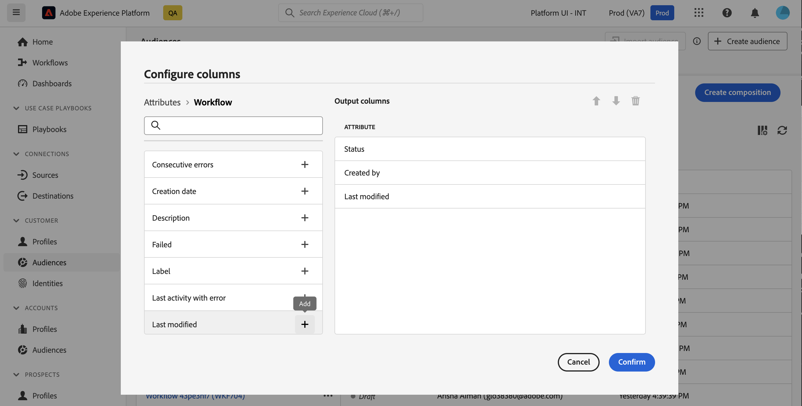

# Kom igång med kompositioner {#compositions}

## Vad är en komposition? {#what}

Med Adobe Data Composition kan du skapa kompositioner där du kan använda olika aktiviteter (dela, exkludera..) i en visuell arbetsyta för att skapa målgrupper. När det är klart sparas de resulterande målgrupperna i Adobe Experience Platform tillsammans med befintliga målgrupper och kan utnyttjas till målgrupper som Journey Optimizer.

## Få åtkomst till och hantera kompositioner {#access}

>[!CONTEXTUALHELP]
>id="dc_composition_list"
>title="Kompositioner"
>abstract="På den här skärmen kan du komma åt den fullständiga listan med kompositioner, kontrollera deras aktuella status, senaste/nästa körningsdatum och skapa en ny komposition."

Kompositioner är tillgängliga från Adobe Experience Platform **[!UICONTROL Audiences]** -menyn på **Sammansatta kompositioner** -fliken.

Från den här skärmen kan du skapa nya kompositioner och komma åt befintliga. Du kan också duplicera eller ta bort en befintlig komposition genom att klicka på ellipsknappen bredvid dess namn.

Om du vill förfina listan och enkelt hitta den komposition du söker efter kan du söka i listan och filtrera kompositioner efter deras status eller senaste bearbetningsdatum.

Du kan också anpassa listan genom att lägga till eller ta bort kolumner. Klicka på **Konfigurera kolumn** s och lägg till eller ta bort önskade utdatakolumner.

## Kompositionsstatus {#status}

Kompositioner kan ha flera statusvärden:

* **[!UICONTROL Draft]**: Kompositionen har skapats och sparats.
* **[!UICONTROL In progress]**: Kompositionen har körts och körs för närvarande.
* **[!UICONTROL Stopped]**: Kompositionskörningen har stoppats.
* **[!UICONTROL Paused]**: Kompositionskörningen har pausats.
* **[!UICONTROL Erroneous]**: Kompositionskörningen har påträffat ett fel. Öppna kompositionen och öppna loggarna och aktiviteterna för att identifiera felet och åtgärda det.

Detaljerad information om hur du startar och övervakar en komposition finns i [det här avsnittet](../compositions/start-monitor-composition.md).