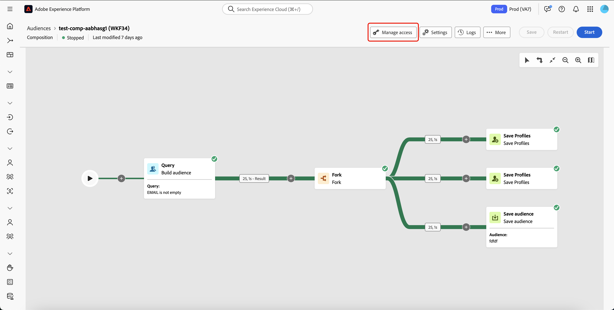

# Kom igång med kompositioner {#compositions}

>[!AVAILABILITY]
>
>Du behöver en av följande behörigheter för att få åtkomst till kompositioner:
>
>-**Hantera sammanslagna kompositioner**
>-**Visa sammanslagna kompositioner**
>
>Mer information om vilka behörigheter som krävs finns i [åtkomstkontrollguiden](/help/governance-privacy-security/access-control.md).

Med Federated Audience Composition kan du skapa kompositioner där du kan använda olika aktiviteter i en visuell arbetsyta för att skapa målgrupper. När du har skapat din komposition sparas målgrupperna i Adobe Experience Platform och kan utnyttjas till Experience Platform destinationer och Adobe Journey Optimizer för att nå ut till kunderna.

{zoomable="yes"}{width="70%"}

## Få åtkomst till och hantera kompositioner {#access}

>[!CONTEXTUALHELP]
>id="dc_composition_list"
>title="Kompositioner"
>abstract="På den här skärmen kan du komma åt den fullständiga listan med kompositioner, kontrollera deras aktuella status, senaste/nästa körningsdatum och skapa en ny komposition."

Kompositioner är tillgängliga från Adobe Experience Platform-menyn **[!UICONTROL Audiences]** på fliken **[!UICONTROL Federated compositions]** i avsnittet **[!UICONTROL Customers]**.

Från den här skärmen kan du skapa nya kompositioner och komma åt befintliga. Du kan också duplicera eller ta bort en befintlig komposition genom att markera knappen  bredvid dess namn.

Du kan även visa information om kompositionerna, inklusive namn, status, skapare och datum för senaste ändringen.

| Status | Beskrivning |
| ------ | ----------- |
| **[!UICONTROL Draft]** | Dispositionen har skapats och sparats. |
| **[!UICONTROL In progress]** | Kompositionen har körts och körs för närvarande. |
| **[!UICONTROL Stopped]** | Kompositionskörningen är klar och har stoppats. |
| **[!UICONTROL Paused]** | Kompositionskörningen har pausats. |
| **[!UICONTROL Erroneous]** | Kompositionskörningen har påträffat ett fel. Om du vill visa mer information om felet öppnar du kompositionen och öppnar loggarna. |

Du kan lära dig att starta eller stoppa en komposition i guiden [Starta och övervaka komposition](./start-monitor-composition.md).

{zoomable="yes"}{width="70%"}

Om du vill förfina listan och hitta den komposition du söker efter kan du söka i listan och filtrera kompositioner efter deras status eller senaste bearbetningsdatum.

Du kan också anpassa listan genom att lägga till eller ta bort kolumner. Det gör du genom att markera knappen **[!UICONTROL Configure columns]** och lägga till eller ta bort de önskade utdatakolumnerna.

{zoomable="yes"}{width="70%"}

### Använd åtkomstetiketter {#access-labels}

Om du vill använda åtkomstetiketter på en viss komposition väljer du kompositionen följt av **[!UICONTROL Manage access]**.

{zoomable="yes"}{width="70%"}

**[!UICONTROL Manage access]**-pekaren visas. På den här sidan kan du använda de tillämpliga etiketterna för åtkomst och datastyrning i din komposition.

{zoomable="yes"}{width="70%"}

| Etikettyp | Beskrivning |
| ---------- | ----------- |
| Kontraktsetiketter | Kontraktsetiketter (&quot;C&quot;-etiketter) används för att kategorisera data som har avtalsmässiga skyldigheter eller som är relaterade till organisationens policyer för datastyrning. |
| Identitetsetiketter | Identitetsetiketter (&quot;I&quot;-etiketter) används för att kategorisera data som kan identifiera eller kontakta en viss person. |
| Känsliga etiketter | Känsliga etiketter (&quot;S&quot;-etiketter) används för att kategorisera dig och/eller din organisation som anser vara känslig. |
| Etiketter för partnerekosystem | Etiketter för ekosystem för partners används för att kategorisera data från externa källor för din organisation. |

Mer information om åtkomst och datastyrningsetiketter finns i [etikettordlistan för dataanvändning](https://experienceleague.adobe.com/en/docs/experience-platform/data-governance/labels/reference).

## Nästa steg

När du har läst den här guiden har du lärt dig hur du får åtkomst till, hanterar och skapar åtkomstetiketter för dina kompositioner. Mer information om hur du arbetar med målgrupper som helhet finns i [målgruppsguiden](../start/audiences.md).
