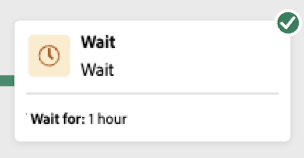

# Starta och övervaka kompositionen {#start-monitor}

När du har skapat kompositionen och utformat de uppgifter som ska utföras på arbetsytan kan du starta den och övervaka hur den körs.

## Starta kompositionen {#start}

Om du vill starta en komposition klickar du på knappen **[!UICONTROL Start]** i skärmens övre högra hörn. När kompositionen körs utförs varje aktivitet på arbetsytan i sekventiell ordning tills kompositionen är klar.

Du kan spåra förloppet för målprofiler i realtid med ett visuellt flöde. På så sätt kan du snabbt identifiera status för varje aktivitet och antalet profiler som övergår mellan dem.

## Dispositionsövergångar {#transitions}

I kompositioner lagras data som överförs från en aktivitet till en annan genom övergångar i ett tillfälligt arbetsregister. Dessa data kan visas för varje övergång. Det gör du genom att markera en övergång och öppna dess egenskaper till höger på skärmen.

* Klicka på **[!UICONTROL Preview schema]** för att visa arbetstabellens schema.
* Klicka på **[!UICONTROL Preview results]** om du vill visa de data som har transporterats i den valda övergången. Det här alternativet är bara tillgängligt om alternativet **[!UICONTROL Keep the result of interim populations between two executions]** är aktiverat. [Läs mer](create-composition.md#settings).

## Körning av övervakningsaktivitet {#activities}

Med visuella indikatorer i det övre högra hörnet av varje aktivitetsruta kan du kontrollera deras körning:

| Visuell indikator | Beskrivning |
|-----|------------|
| {zoomable="yes"}{width="70%"} | Aktiviteten körs för närvarande. |
| {zoomable="yes"}{width="70%"} | Aktiviteten kräver din uppmärksamhet. Detta kan inbegripa att bekräfta leveransen eller vidta nödvändiga åtgärder. |
| {zoomable="yes"}{width="70%"} | Aktiviteten har påträffat ett fel. Lös problemet genom att öppna dispositionsloggarna för mer information. |
| {zoomable="yes"}{width="70%"} | Aktiviteten har körts. |

## Övervaka loggar och uppgifter {#logs-tasks}

Att övervaka kompositionsloggar och -uppgifter är ett viktigt steg för att analysera kompositionerna och se till att de körs som de ska. De är tillgängliga från knappen **[!UICONTROL Logs]** som är tillgänglig i åtgärdsverktygsfältet och i egenskapsrutan för varje aktivitet.

Skärmen **[!UICONTROL Composition logs and tasks]** innehåller en historik över dispositionskörningen, där alla användaråtgärder och påträffade fel registreras.

<!-- à confirmer, pas trouvé dans les options = The workflow history is saved for the duration specified in the workflow execution options. During this duration, all the messages are therefore saved, even after a restart. If you do not want to save the messages from a previous execution, you have to purge the history by clicking the  button.-->

Historien är ordnad på flera flikar, som beskrivs nedan:

* Fliken **[!UICONTROL Log]** innehåller körningshistoriken för alla dispositionsaktiviteter. Den indexerar de åtgärder som utförts och körningsfel i kronologisk ordning.
* Fliken **[!UICONTROL Tasks]** innehåller information om körningssekvensen för aktiviteterna. Med knappen som finns i slutet av varje uppgift kan du visa de händelsevariabler som skickats genom aktiviteten.
* Fliken **[!UICONTROL Variables]** visar alla variabler som skickats i kompositionen. Det är endast tillgängligt när du får åtkomst till loggar och uppgifter från dispositionsarbetsytan. Det är nu tillgängligt när du öppnar loggarna från en aktivitets egenskapspanel.  <!-- à confirmer-->

På alla flikar kan du välja vilka kolumner som ska visas och i vilken ordning de ska visas, tillämpa filter och använda sökfältet för att snabbt hitta önskad information.

## Kommandon för kompositionskörning {#execution-commands}

Åtgärdsfältet i det övre högra hörnet innehåller kommandon som gör att du kan hantera kompositionskörningen.

Tillgängliga åtgärder är:

* **[!UICONTROL Start]**: Startar körningen av kompositionen, som sedan får statusen **[!UICONTROL In progress]**. Kompositionen påbörjas och de inledande aktiviteterna aktiveras.

* **[!UICONTROL Resume]**: Återupptar körningen av kompositionen som pausats. Dispositionen får statusen **[!UICONTROL In progress]**.

* **[!UICONTROL Pause]** körningen av kompositionen, som sedan får statusen **[!UICONTROL Paused]**. Inga nya aktiviteter kommer att aktiveras förrän de återupptas, men pågående åtgärder avbryts inte.

* **[!UICONTROL Stop]** en komposition som körs, som sedan får statusen **[!UICONTROL Finished]**. De pågående åtgärderna avbryts om möjligt. Du kan inte återuppta från kompositionen från samma plats som den stoppades.

* **[!UICONTROL Restart]**: Stoppar och startar sedan om en disposition. I de flesta fall gör detta att du kan starta om snabbare, eftersom det tar en viss tid att stoppa och knappen **[!UICONTROL Start]** är bara tillgänglig när stoppet börjar gälla.
