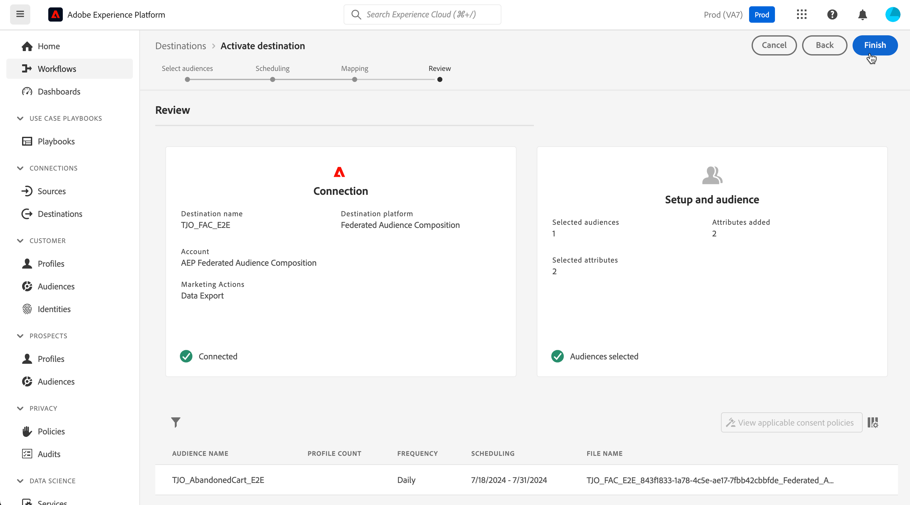

# Berika Adobe Experience Platform målgrupper med externa data {#connect-aep-fac}

>[!CONTEXTUALHELP]
>id="dc_new_destination"
>title="Skapa ett mål"
>abstract="Ange inställningarna för att ansluta till den nya Federated databasen. Använd knappen **[!UICONTROL Connect to destination]** för att validera konfigurationen."

Adobe Experience Platform möjliggör smidig integrering av målgrupper från Audience Portal med dina externa databaser med hjälp av **Adobe Federated Audience Composition-målet**. Med den här integreringen kan ni utnyttja befintliga målgrupper i kompositioner och berika eller förfina dem med data från externa databaser för att skapa nya målgrupper.

För att göra det måste du skapa en ny anslutning i Adobe Experience Platform till Adobe Federated Audience Composition-målet. Du kan använda en schemaläggare för att skicka en viss målgrupp med regelbundna intervall, välja specifika attribut att inkludera, t.ex. ID:n för datavstämning. Om ni har tillämpat styrnings- och integritetspolicyer på er målgrupp kommer de att behållas och skickas tillbaka till målgruppsportalen när målgruppen har uppdaterats.

Låt oss till exempel säga att ni lagrar inköpsinformation på ert datalager och har en Adobe Experience Platform-målgrupp som riktar sig till kunder som är intresserade av en viss produkt de senaste två månaderna. Med Federated Audience Composition-målet kan du:

* Förfina målgruppen baserat på inköpsinformation. Du kan t.ex. filtrera målgruppen så att den endast riktar sig till kunder som köpt mer än 150 dollar.
* Gör det lättare för publiken att hitta fält för inköp, t.ex. produktnamn och inköpskvantitet.

De viktigaste stegen för att skicka Adobe Experience Platform-målgrupper till Adobe Federated Audience Composition är följande:

1. Gå till Adobe Experience Platform destinationskatalog och välj mål för federerad målgruppskomposition.

   Välj **[!UICONTROL Configure new destination]** i den högra rutan.

   

1. Ange ett namn för den nya anslutningen, välj den **[!UICONTROL Connection type]** som ska användas och den **[!UICONTROL Federated database]** som du vill ansluta till och klicka på **[!UICONTROL Next]**.

   

   I avsnittet **[!UICONTROL Alerts]** kan du aktivera aviseringar för att få meddelanden om dataflödets status till ditt mål. Mer information om varningar finns i Adobe Experience Platform-dokumentationen om att [prenumerera på destinationsvarningar med användargränssnittet](https://experienceleague.adobe.com/en/docs/experience-platform/destinations/ui/alerts){target="_blank"}

1. I steget **[!UICONTROL Governance policy & enforcement actions]** kan du definiera dina datastyrningsprinciper och se till att de data som används är kompatibla när målgrupper skickas och är aktiva.

   När du är klar med att välja önskade marknadsföringsåtgärder för målet klickar du på **[!UICONTROL Create]**.

1. Den nya anslutningen till målet skapas. Nu kan du aktivera målgrupper att skicka över till målet. Om du vill göra det markerar du den i listan och klickar på **[!UICONTROL Next]**

   

1. Markera önskade målgrupper som du vill skicka och klicka på **[!UICONTROL Next]**.

1. Konfigurera filnamnet och ett exportschema för de valda målgrupperna.

   

   >[!NOTE]
   >
   >Detaljerad information om hur du konfigurerar schema och filnamn finns i följande avsnitt i Adobe Experience Platform-dokumentationen:
   >
   >* [Schemalägg målgruppsexport](https://experienceleague.adobe.com/en/docs/experience-platform/destinations/ui/activate/activate-batch-profile-destinations#scheduling){target="_blank"}
   >* [Konfigurera filnamn](https://experienceleague.adobe.com/en/docs/experience-platform/destinations/ui/activate/activate-batch-profile-destinations#configure-file-names){target="_blank"}

1. I steget **[!UICONTROL Mapping]** väljer du vilka attribut- och identitetsfält som ska exporteras för målgruppen/målgrupperna. Mer information finns i [mappningssteget](https://experienceleague.adobe.com/en/docs/experience-platform/destinations/ui/activate/activate-batch-profile-destinations#mapping){target="_blank"} i Adobe Experience Platform-dokumentationen.

   

1. Granska målkonfigurationen och målgruppsinställningarna och klicka sedan på **[!UICONTROL Finish]**.

   

De valda målgrupperna är nu aktiverade för den nya anslutningen. Du kan lägga till fler målgrupper att skicka med den här anslutningen genom att gå tillbaka till sidan **[!UICONTROL Activate audiences]**. Du kan inte ta bort målgrupper när de har aktiverats.
