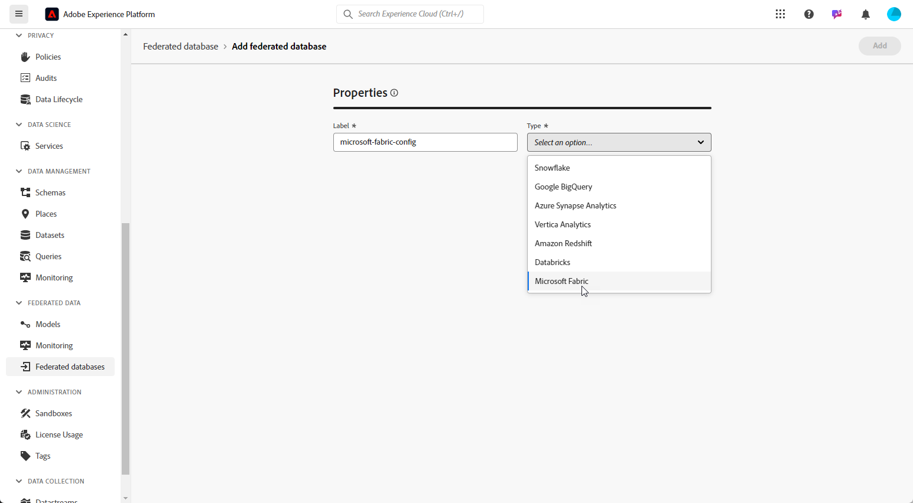

# Konfigurera dina Federated databaser {#federated-db}

>[!CONTEXTUALHELP]
>id="dc_connection_federated_database_menu"
>title="Federerade databaser"
>abstract="Befintliga anslutningar till Federated databaser visas på den här skärmen. Klicka på knappen **[!UICONTROL Add federated database]** om du vill skapa en ny anslutning."

>[!CONTEXTUALHELP]
>id="dc_connection_federated_database_properties"
>title="Federerade databasegenskaper"
>abstract="Ange namnet på den nya Federated databasen och välj dess typ."

>[!CONTEXTUALHELP]
>id="dc_connection_federated_database_details"
>title="Information om federerad databas"
>abstract="Ange inställningarna för att ansluta till den nya Federated databasen. Använd knappen **[!UICONTROL Test connection]** för att validera konfigurationen."

Med Experience Platform Federated Audience Composition kan kunden skapa och berika målgrupper från tredjeparts datalager och importera målgrupperna till Adobe Experience Platform.

Lär dig hur du skapar, konfigurerar, testar och sparar anslutningen till din externa databas på [den här sidan](connections.md). Nedan finns en lista över databaser som stöds och detaljerade inställningar som kan konfigureras för var och en av dem.

## Databaser som stöds {#supported-db}

Med Federated Audience Composition kan du ansluta till följande databaser. Konfigurationen för varje databas beskrivs nedan.

* [Amazon Redshift](#amazon-redshift)
* [Azure Synapse Analytics](#azure-synapse)
* [Google BigQuery](#google-bigquery)
* [Snowflake](#snowflake)
* [Vertica Analytics](#vertica-analytics)
* [Databricks](#databricks)
* [Microsoft Fabric](#microsoft-fabric)

## Amazon Redshift {#amazon-redshift}

>[!NOTE]
>
>* Endast Amazon Redshift AWS, Amazon Redshift Spectrum och Amazon Redshift Serverless stöds.
>
>* Säker åtkomst till dina externa Amazon Redshift-databaser via en privat länk stöds.

Använd Federated databaser för att bearbeta information som lagras i en extern databas. Följ stegen nedan för att konfigurera åtkomst till Amazon Redshift.

1. Välj **[!UICONTROL Federated databases]** på menyn **[!UICONTROL Federated data]**.

1. Klicka på **[!UICONTROL Add federated database]**.

   

1. Ange en **[!UICONTROL Name]** till din Federate-databas.

1. I listrutan **[!UICONTROL Type]** väljer du Amazon Redshift.

   

1. Konfigurera autentiseringsinställningarna för Amazon Redshift:

   * **[!UICONTROL Server]**: Lägg till namnet på DNS.

   * **[!UICONTROL Account]**: Lägg till användarnamnet.

   * **[!UICONTROL Password]**: Lägg till kontolösenordet.

   * **[!UICONTROL Database]**: Namnet på databasen om det inte anges i DSN. Den kan lämnas tom om den anges i DSN

   * **[!UICONTROL Working schema]**: Namnet på databasschemat som ska användas för arbetstabeller. Läs mer i [Amazon-dokumentation](https://docs.aws.amazon.com/redshift/latest/dg/r_Schemas_and_tables.html){target="_blank"}

     >[!NOTE]
     >
     >Du kan använda vilket schema som helst från databasen, inklusive scheman som används för temporär databearbetning, så länge du har den behörighet som krävs för att ansluta till det här schemat.
     >
     >**Distinkta arbetsscheman** måste användas när du ansluter flera sandlådor med samma databas.

1. Välj alternativet **[!UICONTROL Test the connection]** för att verifiera din konfiguration.

1. Klicka på knappen **[!UICONTROL Deploy functions]** för att skapa funktionerna.

1. När konfigurationen är klar klickar du på **[!UICONTROL Add]** för att skapa din Federate-databas.

## Azure Synapse Analytics {#azure-synapse}

Använd Federated databaser för att bearbeta information som lagras i en extern databas. Följ stegen nedan för att konfigurera åtkomst till Azure Synapse Analytics.

1. Välj **[!UICONTROL Federated databases]** på menyn **[!UICONTROL Federated data]**.

1. Klicka på **[!UICONTROL Add federated database]**.

   

1. Ange en **[!UICONTROL Name]** till din Federate-databas.

1. I listrutan **[!UICONTROL Type]** väljer du Azure Synapse Analytics.

   

1. Konfigurera autentiseringsinställningarna för Azure Synapse Analytics:

   * **[!UICONTROL Server]**: Ange URL-adressen för Azure Synapse-servern.

   * **[!UICONTROL Account]**: Ange användarnamnet.

   * **[!UICONTROL Password]**: Ange kontolösenordet.

   * **[!UICONTROL Database]** (valfritt): Ange namnet på databasen om det inte anges i DSN.

   * **[!UICONTROL Options]**: Kopplingen stöder de alternativ som anges i tabellen nedan.

1. Välj alternativet **[!UICONTROL Test the connection]** för att verifiera din konfiguration.

1. Klicka på knappen **[!UICONTROL Deploy functions]** för att skapa funktionerna.

1. När konfigurationen är klar klickar du på **[!UICONTROL Add]** för att skapa din Federate-databas.

| Alternativ | Beskrivning |
|---|---|
| Autentisering | Typ av autentisering som stöds av kopplingen. Aktuellt värde: ActiveDirectoryMSI. Mer information finns i [Microsoft SQL-dokumentation](https://learn.microsoft.com/en-us/sql/connect/odbc/using-azure-active-directory?view=sql-server-ver15#example-connection-strings){target="_blank"} (Exempel på anslutningssträngar n°8) |

## Google BigQuery {#google-bigquery}

Använd Federated databaser för att bearbeta information som lagras i en extern databas. Följ stegen nedan för att konfigurera åtkomst till Google BigQuery.

1. Välj **[!UICONTROL Federated databases]** på menyn **[!UICONTROL Federated data]**.

1. Klicka på **[!UICONTROL Add federated database]**.

   

1. Ange en **[!UICONTROL Name]** till din Federate-databas.

1. I listrutan **[!UICONTROL Type]** väljer du Google BigQuery.

   

1. Konfigurera autentiseringsinställningarna för Google BigQuery:

   * **[!UICONTROL Service account]**: Ange e-postadressen till **[!UICONTROL Service account]**. Mer information finns i [Google Cloud-dokumentationen](https://cloud.google.com/iam/docs/creating-managing-service-accounts){target="_blank"}.

   * **[!UICONTROL Project]**: Ange ID:t för **[!UICONTROL Project]**. Mer information finns i [Google Cloud-dokumentationen](https://cloud.google.com/resource-manager/docs/creating-managing-projects){target="_blank"}.

   * **[!UICONTROL Dataset]**: Ange namnet på **[!UICONTROL Dataset]**. Mer information finns i [Google Cloud-dokumentationen](https://cloud.google.com/bigquery/docs/datasets-intro){target="_blank"}.

   * **[!UICONTROL Key file Path]**: Överför nyckelfilen till servern. Endast JSON-filer accepteras.

   * **[!UICONTROL Options]**: Kopplingen stöder de alternativ som anges i tabellen nedan.

1. Välj alternativet **[!UICONTROL Test the connection]** för att verifiera din konfiguration.

1. Klicka på knappen **[!UICONTROL Deploy functions]** för att skapa funktionerna.

1. När konfigurationen är klar klickar du på **[!UICONTROL Add]** för att skapa din Federate-databas.

| Alternativ | Beskrivning |
|---|---|
| ProxyType | Typ av proxy som används för att ansluta till BigQuery via ODBC- och SDK-anslutningar.  HTTP (standard), http_no_tunnel, sockor4 och sockor5 stöds för närvarande. |
| ProxyHost | Värdnamn eller IP-adress dit proxyn kan nås. |
| ProxyPort | Portnummer som proxyn körs på, till exempel 8080 |
| ProxyUid | Användarnamn som används för autentiserad proxy |
| ProxyPwd | ProxyUid-lösenord |
| bqpath | Observera att detta endast gäller för massinläsningsverktyg (Cloud SDK).   Om du vill undvika att använda variabeln PATH eller om katalogen google-cloud-sdk måste flyttas till en annan plats, kan du med det här alternativet ange den exakta sökvägen till bin-katalogen i molnet på servern. |
| GCloudConfigName | Observera att detta gäller från och med version 7.3.4 och endast för massinläsningsverktyg (Cloud SDK).  Google Cloud SDK använder konfigurationer för att läsa in data i BigQuery-tabeller. Konfigurationen med namnet `accfda` lagrar parametrarna för att läsa in data. Med det här alternativet kan användare ange ett annat namn för konfigurationen. |
| GCloudDefaultConfigName | Observera att detta gäller från och med version 7.3.4 och endast för massinläsningsverktyg (Cloud SDK).  Den aktiva SDK-konfigurationen för Google Cloud kan inte tas bort utan att den aktiva taggen först överförs till en ny konfiguration. Den här tillfälliga konfigurationen är nödvändig för att återskapa huvudkonfigurationen för inläsning av data. Standardnamnet för den tillfälliga konfigurationen är `default`, vilket kan ändras vid behov. |
| GCloudRecreateConfig | Observera att detta gäller från och med version 7.3.4 och endast för massinläsningsverktyg (Cloud SDK).  När värdet är `false` avstår massinläsningsfunktionen från att försöka återskapa, ta bort eller ändra SDK-konfigurationerna för Google Cloud. I stället fortsätter programmet med datainläsning med den befintliga konfigurationen på datorn. Den här funktionen är värdefull när andra åtgärder är beroende av Google Cloud SDK-konfigurationer.   Om användaren aktiverar det här motoralternativet utan rätt konfiguration kommer massinläsningsmekanismen att skicka ett varningsmeddelande: `No active configuration found. Please either create it manually or remove the GCloudRecreateConfig option`. Om du vill förhindra fler fel återgår den till att använda ODBC-standardmetoden för gruppinläsning av ODBC-matris. |

## Snowflake {#snowflake}

>[!NOTE]
>
>Säker åtkomst till ditt externa Snowflake-datalager via en privat länk stöds. Observera att ditt Snowflake-konto måste ligga på Amazon Web Services (AWS) eller Azure och finnas i samma region som din Federated Audience Composition-miljö. Kontakta din Adobe-representant för att få hjälp med att konfigurera säker åtkomst till ditt Snowflake-konto.
>

Använd Federated databaser för att bearbeta information som lagras i en extern databas. Följ stegen nedan för att konfigurera åtkomst till Snowflake.

1. Välj **[!UICONTROL Federated databases]** på menyn **[!UICONTROL Federated data]**.

1. Klicka på **[!UICONTROL Add federated database]**.

   

1. Ange en **[!UICONTROL Name]** till din Federate-databas.

1. I listrutan **[!UICONTROL Type]** väljer du Snowflake.

   

1. Konfigurera autentiseringsinställningarna för Snowflake:

   * **[!UICONTROL Server]**: Ange ditt servernamn.

   * **[!UICONTROL User]**: Ange ditt användarnamn.

   * **[!UICONTROL Password]**: Ange ditt lösenord för kontot.

   * **[!UICONTROL Database]** (valfritt): Ange namnet på databasen om det inte anges i DSN.

   * **[!UICONTROL Working schema]** (valfritt): Ange namnet på databasschemat som ska användas för arbetstabeller.

     >[!NOTE]
     >
     >Du kan använda vilket schema som helst från databasen, inklusive scheman som används för temporär databearbetning, så länge du har den behörighet som krävs för att ansluta till det här schemat.
     >
     >**Distinkta arbetsscheman** måste användas när du ansluter flera sandlådor med samma databas.

   * **[!UICONTROL Private key]**: Klicka på fältet **[!UICONTROL Private key]** för att välja dina .pem-filer från din språkmapp.

   * **[!UICONTROL Options]**: Kopplingen stöder de alternativ som anges i tabellen nedan.

1. Välj alternativet **[!UICONTROL Test the connection]** för att verifiera din konfiguration.

1. Klicka på knappen **[!UICONTROL Deploy functions]** för att skapa funktionerna.

1. När konfigurationen är klar klickar du på **[!UICONTROL Add]** för att skapa din Federate-databas.

Kopplingen stöder följande alternativ:

| Alternativ | Beskrivning |
|---|---|
| arbetsschema | Databasschema som ska användas för arbetsregister |
| lagerställe | Namnet på standardlagerstället som ska användas. Det åsidosätter användarens standardvärde. |
| TimeZoneName | Som standard är den tom, vilket innebär att systemets tidszonsprogramserver används. Alternativet kan användas för att framtvinga TIMEZONE-sessionsparametern.  Mer information finns på [den här sidan](https://docs.snowflake.net/manuals/sql-reference/parameters.html#timezone){target="_blank"}. |
| WeekStart | WEEK_START-sessionsparameter. Standardinställningen är 0.  Mer information finns på [den här sidan](https://docs.snowflake.com/en/sql-reference/parameters.html#week-start){target="_blank"}. |
| AnvändCachedResult | USE_CACHED_RESULTS sessionsparameter. Standardinställningen är TRUE. Det här alternativet kan användas för att inaktivera cachelagrade Snowflake-resultat.  Mer information finns på [den här sidan](https://docs.snowflake.net/manuals/user-guide/querying-persisted-results.html){target="_blank"}. |
| bulkThreads | Fler trådar innebär bättre prestanda för större massinläsning när det gäller antalet trådar som ska användas för Snowflake-inläsning. Standardinställningen är 1. Numret kan justeras beroende på antalet datortrådar. |
| chunkSize | Bestämmer filstorleken för gruppinläsarsegmentet. Standardinställningen är 128 MB. Kan ändras för att få optimala prestanda när de används med bulkThreads. Fler samtidiga aktiva trådar innebär bättre prestanda.  Mer information finns i [Snowflake-dokumentationen](https://docs.snowflake.net/manuals/sql-reference/sql/put.html){target="_blank"}. |
| StageName | Namnet på den förallokerade interna scenen. Den används i massinläsning i stället för att skapa en ny tillfällig fas. |

## Vertica Analytics {#vertica-analytics}

Använd Federated databaser för att bearbeta information som lagras i en extern databas. Följ stegen nedan för att konfigurera åtkomst till Vertica Analytics.

1. Välj **[!UICONTROL Federated databases]** på menyn **[!UICONTROL Federated data]**.

1. Klicka på **[!UICONTROL Add federated database]**.

   

1. Ange en **[!UICONTROL Name]** till din Federate-databas.

1. I listrutan **[!UICONTROL Type]** väljer du Vertica Analytics.

   

1. Konfigurera autentiseringsinställningarna för Vertica Analytics:

   * **[!UICONTROL Server]**: Lägg till URL:en för servern [!DNL Vertica Analytics].

   * **[!UICONTROL Account]**: Lägg till användarnamnet.

   * **[!UICONTROL Password]**: Lägg till kontolösenordet.

   * **[!UICONTROL Database]** (valfritt): Ange namnet på databasen om det inte anges i DSN.

   * **[!UICONTROL Working schema]** (valfritt): Ange namnet på databasschemat som ska användas för arbetstabeller.

     >[!NOTE]
     >
     >Du kan använda vilket schema som helst från databasen, inklusive scheman som används för temporär databearbetning, så länge du har den behörighet som krävs för att ansluta till det här schemat.
     >
     >**Distinkta arbetsscheman** måste användas när du ansluter flera sandlådor med samma databas.

   * **[!UICONTROL Options]**: Kopplingen stöder de alternativ som anges i tabellen nedan.

1. Välj alternativet **[!UICONTROL Test the connection]** för att verifiera din konfiguration.

1. Klicka på knappen **[!UICONTROL Deploy functions]** för att skapa funktionerna.

1. När konfigurationen är klar klickar du på **[!UICONTROL Add]** för att skapa din Federate-databas.

Kopplingen stöder följande alternativ:

| Alternativ | Beskrivning |
|---|---|
| TimeZoneName | Som standard är den tom, vilket betyder att programserverns systemtidszon används. Alternativet kan användas för att framtvinga TIMEZONE-sessionsparametern. |

## Databricks {#databricks}

>[!NOTE]
>
>Det finns stöd för säker åtkomst till ditt externa datalager för databanker via en privat länk. Detta inkluderar säkra anslutningar till databaser som lagras på Amazon Web Services (AWS) via privata länkar och databaser som lagras på Microsoft Azure via VPN. Kontakta Adobe om du behöver hjälp med att skapa säker åtkomst.

Använd Federated databaser för att bearbeta information som lagras i en extern databas. Följ stegen nedan för att konfigurera åtkomst till databaser.

1. Välj **[!UICONTROL Federated databases]** på menyn **[!UICONTROL Federated data]**.

1. Klicka på **[!UICONTROL Add federated database]**.

   

1. Ange en **[!UICONTROL Name]** till din Federate-databas.

1. Välj Databricks i listrutan **[!UICONTROL Type]**.

   

1. Konfigurera autentiseringsinställningar för databaser:

   * **[!UICONTROL Server]**: Lägg till namnet på databasservern.

   * **[!UICONTROL HTTP path]**: Lägg till sökvägen till ditt kluster eller lagerställe. [Läs mer](https://docs.databricks.com/en/integrations/compute-details.html){target="_blank"}

   * **[!UICONTROL Password]**: Lägg till kontoåtkomsttoken. [Läs mer](https://docs.databricks.com/en/dev-tools/auth/pat.html){target="_blank"}

   * **[!UICONTROL Catalog]**: Lägg till fältet för databaskatalogen.

   * **[!UICONTROL Working schema]**: Namnet på databasschemat som ska användas för arbetstabeller.

     >[!NOTE]
     >
     >Du kan använda vilket schema som helst från databasen, inklusive scheman som används för temporär databearbetning, så länge du har den behörighet som krävs för att ansluta till det här schemat.
     >
     >**Distinkta arbetsscheman** måste användas när du ansluter flera sandlådor med samma databas.

   * **[!UICONTROL Options]**: Kopplingen stöder de alternativ som anges i tabellen nedan.

1. Välj alternativet **[!UICONTROL Test the connection]** för att verifiera din konfiguration.

1. Klicka på knappen **[!UICONTROL Deploy functions]** för att skapa funktionerna.

1. När konfigurationen är klar klickar du på **[!UICONTROL Add]** för att skapa din Federate-databas.

Kopplingen stöder följande alternativ:

| Alternativ | Beskrivning |
|---|---|
| TimeZoneName | Som standard är den tom, vilket betyder att programserverns systemtidszon används. Alternativet kan användas för att framtvinga TIMEZONE-sessionsparametern. |

## Microsoft Fabric {#microsoft-fabric}

Använd Federated databaser för att bearbeta information som lagras i en extern databas. Följ stegen nedan för att konfigurera åtkomst till Microsoft Fabric.

1. Välj **[!UICONTROL Federated databases]** på menyn **[!UICONTROL Federated data]**.

1. Klicka på **[!UICONTROL Add federated database]**.

   

1. Ange en **[!UICONTROL Name]** till din Federate-databas.

1. I listrutan **[!UICONTROL Type]** väljer du Microsoft Fabric.

   

1. Konfigurera autentiseringsinställningarna för Microsoft Fabric:

   * **[!UICONTROL Server]**: Ange URL:en för Microsoft Fabric-servern.

   * **[!UICONTROL Application ID]**: Ange ditt program-ID för Microsoft Fabric.

   * **[!UICONTROL Client secret]**: Ange din klienthemlighet.

   * **[!UICONTROL Options]**: Kopplingen stöder de alternativ som anges i tabellen nedan.

1. Klicka på **[!UICONTROL Server IPs]** för att välja de server-IP:n som du vill auktorisera.

1. Välj alternativet **[!UICONTROL Test the connection]** för att verifiera din konfiguration.

1. Klicka på knappen **[!UICONTROL Deploy functions]** för att skapa funktionerna.

1. När konfigurationen är klar klickar du på **[!UICONTROL Add]** för att skapa din Federate-databas.

| Alternativ | Beskrivning |
|---|---|
| Autentisering | Typ av autentisering som stöds av kopplingen. Aktuellt värde: ActiveDirectoryMSI. Mer information finns i [Microsoft SQL-dokumentation](https://learn.microsoft.com/en-us/sql/connect/odbc/using-azure-active-directory?view=sql-server-ver15#example-connection-strings){target="_blank"} (Exempel på anslutningssträngar n°8) |

