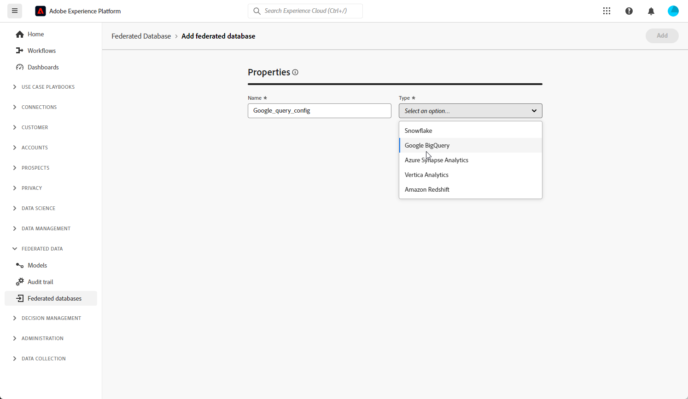

# Kom igång med federerade databaser {#federated-db}

>[!CONTEXTUALHELP]
>id="dc_connection_federated_database_menu"
>title="Federerade databaser"
>abstract="Befintliga anslutningar till federerade databaser visas på den här skärmen. Klicka på knappen **[!UICONTROL Add federated database]** om du vill skapa en ny anslutning."

>[!CONTEXTUALHELP]
>id="dc_connection_federated_database_properties"
>title="Federated Database-egenskaper"
>abstract="Ange namnet på den nya Federated Database och välj dess typ."

>[!CONTEXTUALHELP]
>id="dc_connection_federated_database_details"
>title="Information om federerad databas"
>abstract="Ange inställningarna för att ansluta till den nya Federated Database. Använd knappen **[!UICONTROL Test connection]** för att validera konfigurationen."

Med Federated Audience Composition kan kunden bygga och berika målgrupper från tredjeparts datalager och importera målgrupperna till Adobe Experience Platform.

Lär dig hur du skapar, konfigurerar, testar och sparar anslutningen till din externa databas på den här sidan.

## Databaser som stöds {#supported-db}

Med Federated Audience Composition kan du ansluta till följande databaser. Konfigurationen för varje databas beskrivs nedan.

* [Amazon Redshift](#amazon-redshift)
* [Azure synapse](#azure-synapse-redshift)
* [Google Big Query](#google-big-query)
* [Snowflake](#snowflake)
* [Vertica Analytics](#vertica-analytics)

## Amazon Redshift {#amazon-redshift}

Använd Federated Databases för att bearbeta information som lagras i en extern databas. Följ stegen nedan för att konfigurera åtkomst till Amazon Redshift.

1. Välj **[!UICONTROL Federated databases]** på menyn **[!UICONTROL Federated data]**.

1. Klicka på **[!UICONTROL Add federated database]**.

   

1. Ange en **[!UICONTROL Name]** till din Federate-databas.

1. I listrutan **[!UICONTROL Type]** väljer du Amazon Redshift.

   

1. Konfigurera autentiseringsinställningarna för Amazon Redshift:

   * **[!UICONTROL Server]**: Lägg till namnet på DNS.

   * **[!UICONTROL Account]**: Lägg till användarnamnet.

   * **[!UICONTROL Password]**: Lägg till kontolösenordet.

   * **[!UICONTROL Database]**: Namnet på databasen om det inte anges i DSN. Den kan lämnas tom om den anges i DSN

   * **[!UICONTROL Working schema]**: Namnet på ditt arbetsschema. [Läs mer](https://docs.aws.amazon.com/redshift/latest/dg/r_Schemas_and_tables.html)

1. Välj alternativet **[!UICONTROL Test the connection]** för att verifiera din konfiguration.

1. Klicka på knappen **[!UICONTROL Deploy functions]** för att skapa funktionerna.

1. När konfigurationen är klar klickar du på **[!UICONTROL Add]** för att skapa din Federate-databas.

## Azure synapse Redshift {#azure-synapse-redshift}

Använd Federated Databases för att bearbeta information som lagras i en extern databas. Följ stegen nedan för att konfigurera åtkomst till Azure synapse Redshift.

1. Välj **[!UICONTROL Federated databases]** på menyn **[!UICONTROL Federated data]**.

1. Klicka på **[!UICONTROL Add federated database]**.

   

1. Ange en **[!UICONTROL Name]** till din Federate-databas.

1. I listrutan **[!UICONTROL Type]** väljer du Gör om Azure synapse.

   

1. Konfigurera autentiseringsinställningarna för Azure synapse Redshift:

   * **[!UICONTROL Server]**: Ange URL-adressen för Azure synapse-servern.

   * **[!UICONTROL Account]**: Ange användarnamnet.

   * **[!UICONTROL Password]**: Ange kontolösenordet.

   * **[!UICONTROL Database]** (valfritt): Ange namnet på databasen om det inte anges i DSN.

   * **[!UICONTROL Options]**: Kopplingen stöder de alternativ som anges i tabellen nedan.

1. Välj alternativet **[!UICONTROL Test the connection]** för att verifiera din konfiguration.

1. Klicka på knappen **[!UICONTROL Deploy functions]** för att skapa funktionerna.

1. När konfigurationen är klar klickar du på **[!UICONTROL Add]** för att skapa din Federate-databas.

| Alternativ | Beskrivning |
|:-:|:-:|
| Autentisering | Typ av autentisering som stöds av kopplingen. Aktuellt värde: ActiveDirectoryMSI. Mer information finns i [SQL doc](https://learn.microsoft.com/en-us/sql/connect/odbc/using-azure-active-directory?view=sql-server-ver15#example-connection-strings) (Exempel på anslutningssträngar n°8) |

## Google Big Query {#google-big-query}

Använd Federated Databases för att bearbeta information som lagras i en extern databas. Följ stegen nedan för att konfigurera åtkomst till Google Big Query.

1. Välj **[!UICONTROL Federated databases]** på menyn **[!UICONTROL Federated data]**.

1. Klicka på **[!UICONTROL Add federated database]**.

   

1. Ange en **[!UICONTROL Name]** till din Federate-databas.

1. I listrutan **[!UICONTROL Type]** väljer du Google Big Query.

   

1. Konfigurera autentiseringsinställningarna för Google Big Query:

   * **[!UICONTROL Service account]**: Ange e-postadressen till **[!UICONTROL Service account]**. Mer information finns i [Google Cloud-dokumentationen](https://cloud.google.com/iam/docs/creating-managing-service-accounts).

   * **[!UICONTROL Project]**: Ange namnet på **[!UICONTROL Project]**. Mer information finns i [Google Cloud-dokumentationen](https://cloud.google.com/resource-manager/docs/creating-managing-projects).

   * **[!UICONTROL Dataset]**: Ange namnet på **[!UICONTROL Dataset]**. Mer information finns i [Google Cloud-dokumentationen](https://cloud.google.com/bigquery/docs/datasets-intro).

   * **[!UICONTROL Key file Path]**: Överför nyckelfilen till servern. Endast JSON-filer accepteras.

   * **[!UICONTROL Options]**: Kopplingen stöder de alternativ som anges i tabellen nedan.

1. Välj alternativet **[!UICONTROL Test the connection]** för att verifiera din konfiguration.

1. Klicka på knappen **[!UICONTROL Deploy functions]** för att skapa funktionerna.

1. När konfigurationen är klar klickar du på **[!UICONTROL Add]** för att skapa din Federate-databas.

| Alternativ | Beskrivning |
|:-:|:-:|
| ProxyType | Typ av proxy som används för att ansluta till BigQuery via ODBC- och SDK-anslutningar.  HTTP (standard), http_no_tunnel, sockor4 och sockor5 stöds för närvarande. |
| ProxyHost | Värdnamn eller IP-adress dit proxyn kan nås. |
| ProxyPort | Portnummer som proxyn körs på, till exempel 8080 |
| ProxyUid | Användarnamn som används för autentiserad proxy |
| ProxyPwd | ProxyUid-lösenord |
| bqpath | Observera att detta endast gäller för massinläsningsverktyg (Cloud SDK).   Om du vill undvika att använda variabeln PATH eller om katalogen google-cloud-sdk måste flyttas till en annan plats, kan du med det här alternativet ange den exakta sökvägen till bin-katalogen i molnet på servern. |
| GCloudConfigName | Observera att detta gäller från och med version 7.3.4 och endast för massinläsningsverktyg (Cloud SDK).  Google Cloud SDK använder konfigurationer för att läsa in data i BigQuery-tabeller. Konfigurationen med namnet `accfda` lagrar parametrarna för att läsa in data. Med det här alternativet kan användare ange ett annat namn för konfigurationen. |
| GCloudDefaultConfigName | Observera att detta gäller från och med version 7.3.4 och endast för massinläsningsverktyg (Cloud SDK).  Den aktiva Google Cloud SDK-konfigurationen kan inte tas bort utan att den aktiva taggen först överförs till en ny konfiguration. Den här tillfälliga konfigurationen är nödvändig för att återskapa huvudkonfigurationen för inläsning av data. Standardnamnet för den tillfälliga konfigurationen är `default`, vilket kan ändras vid behov. |
| GCloudRecreateConfig | Observera att detta gäller från och med version 7.3.4 och endast för massinläsningsverktyg (Cloud SDK).  När värdet är `false` avstår massinläsningsfunktionen från att försöka återskapa, ta bort eller ändra Google Cloud SDK-konfigurationerna. I stället fortsätter programmet med datainläsning med den befintliga konfigurationen på datorn. Den här funktionen är värdefull när andra åtgärder är beroende av Google Cloud SDK-konfigurationer.   Om användaren aktiverar det här motoralternativet utan rätt konfiguration kommer massinläsningsmekanismen att skicka ett varningsmeddelande: `No active configuration found. Please either create it manually or remove the GCloudRecreateConfig option`. Om du vill förhindra fler fel återgår den till att använda ODBC-standardmetoden för gruppinläsning av ODBC-matris. |

## Snowflake {#snowflake}

Använd Federated Databases för att bearbeta information som lagras i en extern databas. Följ stegen nedan för att konfigurera åtkomst till Snowflake.

1. Välj **[!UICONTROL Federated databases]** på menyn **[!UICONTROL Federated data]**.

1. Klicka på **[!UICONTROL Add federated database]**.

   

1. Ange en **[!UICONTROL Name]** till din Federate-databas.

1. I listrutan **[!UICONTROL Type]** väljer du Snowflake.

   

1. Konfigurera autentiseringsinställningarna för Snowflake:

   * **[!UICONTROL Server]**: Ange ditt servernamn.

   * **[!UICONTROL User]**: Ange ditt användarnamn.

   * **[!UICONTROL Password]**: Ange ditt lösenord för kontot.

   * **[!UICONTROL Database]** (valfritt): Ange namnet på databasen om det inte anges i DSN.

   * **[!UICONTROL Working schema]** (valfritt): Ange namnet på ditt arbetsschema.

   * **[!UICONTROL Private key]**: Klicka på fältet **[!UICONTROL Private key]** för att välja dina .pem-filer från din språkmapp.

   * **[!UICONTROL Options]**: Kopplingen stöder de alternativ som anges i tabellen nedan.

1. Välj alternativet **[!UICONTROL Test the connection]** för att verifiera din konfiguration.

1. Klicka på knappen **[!UICONTROL Deploy functions]** för att skapa funktionerna.

1. När konfigurationen är klar klickar du på **[!UICONTROL Add]** för att skapa din Federate-databas.

Kopplingen stöder följande alternativ:

| Alternativ | Beskrivning |
|---|---|
| arbetsschema | Databasschema som ska användas för arbetsregister |
| lagerställe | Namnet på standardlagerstället som ska användas. Det åsidosätter användarens standardvärde. |
| TimeZoneName | Som standard är den tom, vilket innebär att systemtidszonen för Campaign Classicens programserver används. Alternativet kan användas för att framtvinga TIMEZONE-sessionsparametern.  Mer information finns på [den här sidan](https://docs.snowflake.net/manuals/sql-reference/parameters.html#timezone). |
| WeekStart | WEEK_START-sessionsparameter. Standardinställningen är 0.  Mer information finns på [den här sidan](https://docs.snowflake.com/en/sql-reference/parameters.html#week-start). |
| AnvändCachedResult | USE_CACHED_RESULTS sessionsparameter. Standardinställningen är TRUE. Det här alternativet kan användas för att inaktivera cachelagrade resultat i Snowflake.  Mer information finns på [den här sidan](https://docs.snowflake.net/manuals/user-guide/querying-persisted-results.html). |
| bulkThreads | Antal trådar som ska användas för Snowflake-massinläsare, fler trådar innebär bättre prestanda för större massinläsningar. Standardinställningen är 1. Numret kan justeras beroende på antalet datortrådar. |
| chunkSize | Bestämmer filstorleken för gruppinläsarsegmentet. Standardinställningen är 128 MB. Kan ändras för att få optimala prestanda när de används med bulkThreads. Fler samtidiga aktiva trådar innebär bättre prestanda.  Mer information finns i [Snowflake-dokumentationen](https://docs.snowflake.net/manuals/sql-reference/sql/put.html). |
| StageName | Namnet på den förallokerade interna scenen. Den används i massinläsning i stället för att skapa en ny tillfällig fas. |

## Vertica Analytics {#vertica-analytics}

Använd Federated Databases för att bearbeta information som lagras i en extern databas. Följ stegen nedan för att konfigurera åtkomst till Vertica analytics.

1. Välj **[!UICONTROL Federated databases]** på menyn **[!UICONTROL Federated data]**.

1. Klicka på **[!UICONTROL Add federated database]**.

   

1. Ange en **[!UICONTROL Name]** till din Federate-databas.

1. I listrutan **[!UICONTROL Type]** väljer du Vertica analytics.

   

1. Konfigurera autentiseringsinställningarna för Vertica analytics:

   * **[!UICONTROL Server]**: Lägg till URL:en för servern [!DNL Vertica Analytics].

   * **[!UICONTROL Account]**: Lägg till användarnamnet.

   * **[!UICONTROL Password]**: Lägg till kontolösenordet.

   * **[!UICONTROL Database]** (valfritt): Ange namnet på databasen om det inte anges i DSN.

   * **[!UICONTROL Working schema]** (valfritt): Ange namnet på ditt arbetsschema.

   * **[!UICONTROL Options]**: Kopplingen stöder de alternativ som anges i tabellen nedan.

1. Välj alternativet **[!UICONTROL Test the connection]** för att verifiera din konfiguration.

1. Klicka på knappen **[!UICONTROL Deploy functions]** för att skapa funktionerna.

1. När konfigurationen är klar klickar du på **[!UICONTROL Add]** för att skapa din Federate-databas.

Kopplingen stöder följande alternativ:

| Alternativ | Beskrivning |
|---|---|
| TimeZoneName | Som standard är den tom, vilket innebär att systemtidszonen för Campaign Classicens programserver används. Alternativet kan användas för att framtvinga TIMEZONE-sessionsparametern. |

