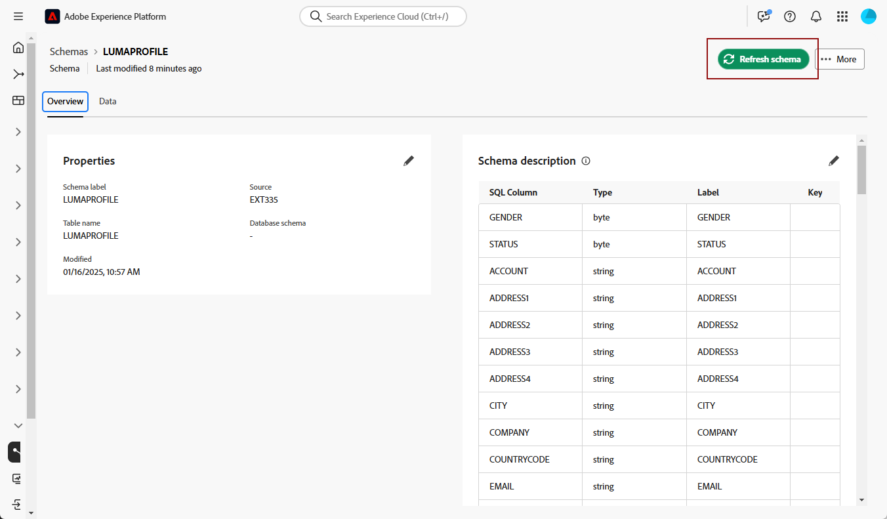

# Kom igång med scheman {#schemas}

>[!AVAILABILITY]
>
>Du behöver en av följande behörigheter för att komma åt scheman:
>
>-**Hantera federerat schema**
>&#x200B;>-**Visa federerat schema**
>
>Mer information om vilka behörigheter som krävs finns i [åtkomstkontrollguiden](/help/governance-privacy-security/access-control.md).

>[!CONTEXTUALHELP]
>id="dc_schema_create_select_tables"
>title="Markera tabeller"
>abstract="Markera de tabeller som ska läggas till för datamodellen."

>[!CONTEXTUALHELP]
>id="dc_schema_create_key"
>title="Nyckel"
>abstract="Välj en nyckel för datavstämning."

>[!CONTEXTUALHELP]
>id="dc_schema_create_schema_name"
>title="Schemats namn"
>abstract="Ange schemats namn."

>[!CONTEXTUALHELP]
>id="dc_schema_edit_description"
>title="Schemabeskrivning"
>abstract="Schemabeskrivningen innehåller kolumner, typer och etiketter. Du kan också kontrollera avstämningsnyckeln för schemat. Om du vill uppdatera schemadefinitionen klickar du på pennikonen."

>[!CONTEXTUALHELP]
>id="dc_schema_filter_sources"
>title="Välj den källdatabas som ska filtreras"
>abstract="Du kan filtrera scheman baserat på deras källa. Välj en eller flera Federated databaser om du vill visa deras scheman."

## Vad är ett schema? {#schema-start}

Ett schema är en representation av en tabell i databasen. Det är ett objekt i programmet som definierar hur data kopplas till databastabeller.

Genom att skapa ett schema kan du definiera en representation av tabellen i Experience Platform Federated Audience Composition:

* Ge den ett eget namn och en beskrivning som förenklar förståelsen för användaren
* Bestäm synligheten för varje fält utifrån deras verkliga användning
* Välj dess primärnyckel för att länka scheman mellan dem efter behov i [datamodellen](../data-management/gs-models.md#data-model-start)

>[!CAUTION]
>
>När du ansluter flera sandlådor med samma databas måste du använda separata arbetsscheman.

## Skapa ett schema {#schema-create}

Välj **[!UICONTROL Models]** i avsnittet **[!UICONTROL Federated Data]** om du vill skapa ett schema i den sammansatta publiksammansättningen. Välj **[!UICONTROL Schema]** på fliken **[!UICONTROL Create schema]**.

{zoomable="yes"}

**[!UICONTROL Select federated database]**-pekaren visas. På den här drivrutinen kan du välja [källdatabasen](/help/connections/home.md) följt av **[!UICONTROL Next]**.

{zoomable="yes"}

Fönstret **Välj tabell** visas. I den här poseraren kan du välja de tabeller som du vill använda för att skapa schemat.

{zoomable="yes"}

Varje markerad tabell genererar ett schema med de valda kolumnerna. För varje tabell kan du ändra schemats etikett, lägga till en beskrivning, byta namn på fältetiketten, ange synlighet för fältetiketten och välja schemats primärnyckel.

{zoomable="yes"}

>[!NOTE]
>
>Om du aktiverar **[!UICONTROL Use Composite Key]** men bara väljer en nyckel som ska användas, behandlas nyckeln som en standardprimärnyckel för schemat.

Dessutom kan du skapa en nyckel som består av flera schemakolumner. Aktivera **[!UICONTROL Use Composite Key]** och markera de tangenter som du vill använda som sammansatt nyckel.

{zoomable="yes"}

När du är klar med konfigurationen väljer du **[!UICONTROL Done]** för att slutföra schemat.

## Redigera ett schema {#schema-edit}

Om du vill redigera ett schema markerar du det schema du skapat tidigare på sidan **Scheman**.

Sidan med schemainformation visas. Markera pennikonen  om du vill redigera schemat.

{zoomable="yes"}

I fönstret **[!UICONTROL Edit schema]** kan du komma åt och konfigurera samma alternativ som när du [skapar ett schema](#schema-create).

{zoomable="yes"}

## Förhandsgranska data i ett schema {#schema-preview}

Om du vill förhandsgranska data i tabellen som representeras av ditt schema går du till fliken **[!UICONTROL Data]** enligt nedan.

Välj länken **[!UICONTROL Calculate]** om du vill förhandsgranska det totala antalet inspelningar.

{zoomable="yes"}

Klicka på knappen **[!UICONTROL Configure columns]** om du vill ändra hur data visas.

{zoomable="yes"}

## Uppdatera ett schema {#schema-refresh}

Tabeller i en federerad databas kan uppdateras, läggas till eller tas bort. I sådana fall måste du uppdatera schemat i Adobe Experience Platform så att det anpassas till de senaste ändringarna. Om du vill utföra det här markerar du ikonen  bredvid schemats namn följt av **[!UICONTROL Refresh schema]**.

Du kan också uppdatera schemadefinitionen när du redigerar den.

{zoomable="yes"}

## Ta bort ett schema {#schema-delete}

Om du vill ta bort ett schema väljer du ikonen  följt av **[!UICONTROL Delete]**.

{zoomable="yes"}
