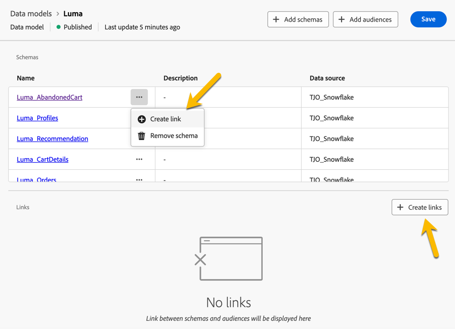
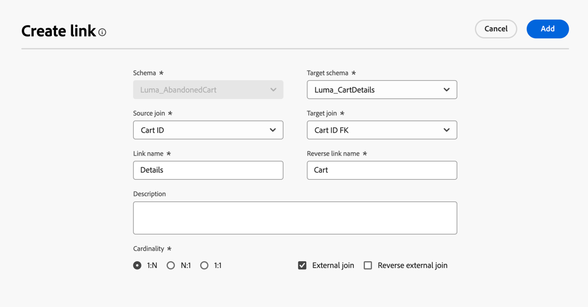
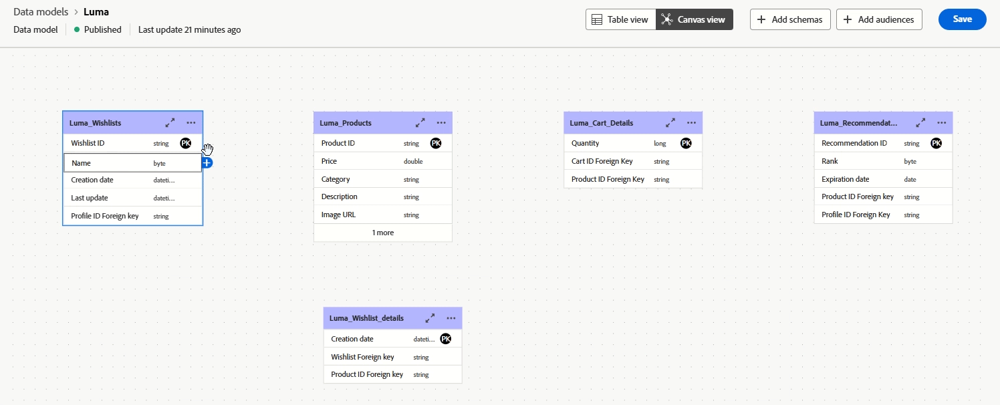
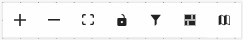

# Kom igång med datamodeller {#data-model-beta}

>[!AVAILABILITY]
>
>Datamodellen med Canvas-vyn är för närvarande tillgänglig som en betaversion för att endast välja användare.

## Vad är en datamodell {#data-model-start}

En datamodell är en uppsättning scheman, målgrupper och länkar mellan dem. Det används för att federera målgrupper med databasdata.

I Federated Audience Composition kan du skapa och hantera datamodeller direkt i arbetsytevyn. Detta inkluderar att lägga till scheman och målgrupper samt att definiera länkarna mellan dem baserat på ditt användningsfall.

Läs mer om [scheman](../customer/schemas.md#schema-start) och [målgrupper](../start/audiences.md).

Du kan till exempel se en representation av en datamodell nedan: tabellerna med namn och länkarna mellan dem.

{zoomable="yes"}

## Skapa en datamodell {#data-model-create}

Så här skapar du en datamodell:

1. Gå till menyn **[!UICONTROL Models]** i avsnittet **[!UICONTROL Federated Data]** och bläddra till fliken **[!UICONTROL Data model]**.

   Klicka på knappen **[!UICONTROL Create data model]**.

   {zoomable="yes"}

1. Definiera namnet på datamodellen och klicka på knappen **[!UICONTROL Create]**.

1. Klicka på **[!UICONTROL Add schemas]** på kontrollpanelen för datamodellen för att välja det schema som är associerat med datamodellen.

   {zoomable="yes"}

1. Klicka på **[!UICONTROL Add Audiences]** för att definiera målgrupperna.

1. Upprätta kopplingar mellan tabeller i datamodellen för att säkerställa korrekta datarelationer. [Läs mer](#data-model-links)

1. När du är klar med konfigurationen klickar du på **[!UICONTROL Save]** för att tillämpa ändringarna.

## Skapa länkar {#data-model-links}

>[!BEGINTABS]

>[!TAB Tabellvy]

Så här skapar du länkar mellan tabeller i datamodellen från fliken Tabellvy:

1. Klicka på **[!UICONTROL Create link]**-menyn i en av tabellerna eller klicka på knappen **[!UICONTROL Create links]** och välj de två tabellerna:

   {zoomable="yes"}

1. Fyll i det angivna formuläret för att definiera länken.

   {zoomable="yes"}

   **Kardinalitet**

   * **1-N**: En förekomst av källtabellen kan ha flera motsvarande förekomster av måltabellen, men en förekomst av måltabellen kan ha högst en motsvarande förekomst av källtabellen.

   * **N-1**: en förekomst av måltabellen kan ha flera motsvarande förekomster av källtabellen, men en förekomst av källtabellen kan ha högst en motsvarande förekomst av måltabellen.

   * **1-1**: En förekomst av källtabellen kan ha högst en motsvarande förekomst av måltabellen.

Alla länkar som är definierade för datamodellen visas nedan:

{zoomable="yes"}

>[!TAB Arbetsytans vy]

Så här skapar du länkar mellan tabeller i datamodellen från fliken Arbetsytans vy:

1. Öppna arbetsytans vy över din datamodell och välj de två tabeller som du vill länka

1. Klicka på knappen  bredvid Source Join och dra sedan pilen mot målhörnet för att upprätta anslutningen.

   {zoomable="yes"}

1. Fyll i det angivna formuläret för att definiera länken och klicka på **[!UICONTROL Apply]** när den har konfigurerats.

   {zoomable="yes"}

   **Kardinalitet**

   * **1-N**: En förekomst av källtabellen kan ha flera motsvarande förekomster av måltabellen, men en förekomst av måltabellen kan ha högst en motsvarande förekomst av källtabellen.

   * **N-1**: en förekomst av måltabellen kan ha flera motsvarande förekomster av källtabellen, men en förekomst av källtabellen kan ha högst en motsvarande förekomst av måltabellen.

   * **1-1**: En förekomst av källtabellen kan ha högst en motsvarande förekomst av måltabellen.

1. Alla länkar som definieras i datamodellen representeras som pilar i arbetsytevyn. Klicka på en pil mellan två tabeller för att visa detaljer, göra ändringar eller ta bort länken efter behov.

   {zoomable="yes"}

1. Använd verktygsfältet för att anpassa och justera arbetsytan.

   

   * **[!UICONTROL Zoom in]**: Förstora arbetsytan om du vill visa detaljer om datamodellen tydligare.
   * **[!UICONTROL Zoom out]**: Minska arbetsytans storlek för en bredare vy av datamodellen.
   * **[!UICONTROL Fit view]**: Justera zoomningen så att den passar alla scheman och/eller målgrupper inom det synliga området.
   * **[!UICONTROL Toggle interactivity]**: Aktivera eller inaktivera användarinteraktion med arbetsytan.
   * **[!UICONTROL Filter]**: Välj vilket schema som ska visas på arbetsytan.
   * **[!UICONTROL Force auto layout]**: Ordna scheman och/eller målgrupper automatiskt för bättre organisation.

>[!ENDTABS]

## Videoinstruktioner {#data-model-video}

Lär dig hur du skapar en datamodell i den här videon:

>[!VIDEO](https://video.tv.adobe.com/v/3432020)
