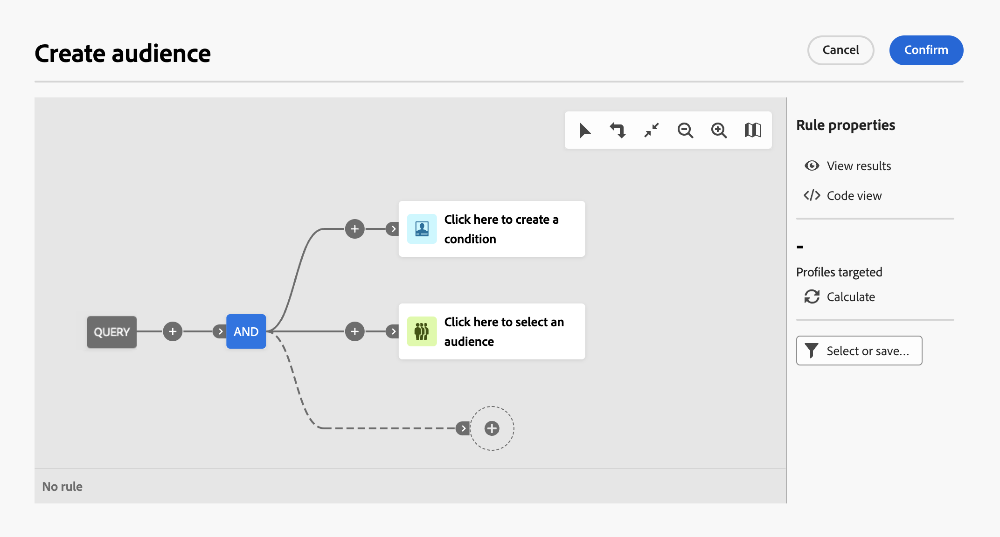

# Arbeta med frågemodelleraren {#segment-builder}

>[!CONTEXTUALHELP]
>id="dc_orchestration_querymodeler_querymessage"
>title="Frågemodelleraren"
>abstract="Definiera filtreringskriterier för mottagare eller andra scheman, som också kallas måldimension, från databasen."

Frågemodelleraren förenklar filtreringen av databasen baserat på olika villkor. Dessutom kan frågemodelleraren hantera mycket komplexa och långa frågor effektivt, vilket ger större flexibilitet och precision. Dessutom har den stöd för fördefinierade filter under förhållanden, vilket gör att du enkelt kan förfina dina frågor samtidigt som du använder avancerade uttryck och operatorer för omfattande målgruppsanpassning och segmenteringsstrategier.

## Åtkomst till frågemodelleraren

Frågemodelleraren är tillgänglig i alla sammanhang där du behöver definiera regler för att filtrera data.

| Användning | Exempel |
|  ---  |  ---  |
| **Definiera målgrupper**: Ange den målgrupp du vill rikta in dig på i dina kompositioner och skapa enkelt nya målgrupper som är anpassade efter dina behov. | {zoomable="yes"}{width="200" align="center" zoomable="yes"} |
| **Anpassa arbetsflödesaktiviteter**: tillämpa regler i dispositionsaktiviteter, t.ex. **Dela** och **Avstämning**, för att passa in dina specifika krav. [Läs mer om dispositionsaktiviteter](../compositions/activities/about-activities.md) | {zoomable="yes"}{width="200" align="center" zoomable="yes"} |

## Gränssnitt för frågemodelleraren {#interface}

Frågemodelleraren innehåller en central arbetsyta där du skapar frågan och en höger ruta med information om frågan.

{zoomable="yes"}

### Den centrala arbetsytan {#canvas}

Frågemodellerarens centrala arbetsyta är där du lägger till och kombinerar de olika komponenterna som skapar din fråga. [Lär dig hur du skapar en fråga](build-query.md)

Verktygsfältet i det övre högra hörnet av arbetsytan innehåller alternativ för att enkelt ändra frågekomponenterna och navigera på arbetsytan:

* **Flervalsläge**: Välj flera filterkomponenter som ska kopieras och klistras in på valfri plats.
* **Rotera**: Växla arbetsytan lodrätt.
* **Anpassa till skärm**: Anpassa arbetsytans zoomnivå till skärmen.
* **Zooma ut** / **Zooma in**: Zooma ut eller in på arbetsytan.
* **Visa karta**: Öppnar en ögonblicksbild av arbetsytan som visar att du befinner dig.

### Rutan Regelegenskaper {#rule-properties}

På höger sida, **[!UICONTROL Rule properties]** innehåller information om frågan. Det gör att du kan utföra olika åtgärder för att kontrollera frågan och se till att den passar dina behov. Den här rutan visas när du skapar en fråga för att skapa en målgrupp. [Lär dig hur du kontrollerar och validerar din fråga](build-query.md#check-and-validate-your-query)
