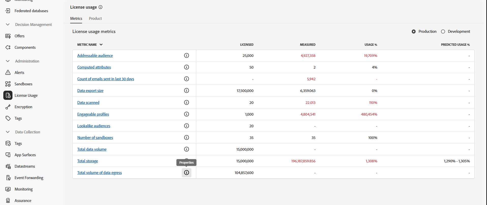
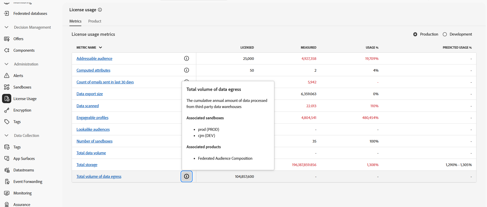

# Förutsättningar och skyddsräcken {#fac-access}

Komposition för federerad publik kräver Adobe Real-Time Customer Data Platform- och/eller Adobe Journey Optimizer **Prime**- eller **Ultimate**-paket. För att få tillgång till den här funktionen måste du ha köpt tillägget Federated Audience Composition.

>[!AVAILABILITY]
>
>När du har fått ett välkomstmeddelande från Adobe kan det ta några timmar innan gränssnittet har uppdaterats och funktionerna är tillgängliga.

## Systemstöd {#supported-systems}

Federated Audience Composition har stöd för följande molnlager:

* Amazon Redshift
* Azure Synapse
* Databricks
* Google BigQuery
* Snowflake
* Vertica Analytics
* Microsoft Fabric

Lär dig hur du skapar en anslutning med dessa system på [den här sidan](../connections/connections.md).

## Sandlådor

När du köper Federated Audience Composition är du berättigad till två sandlådor. Kontakta din Adobe-representant om du vill ha ytterligare förfrågningar om sandlådeetablering.

Följ stegen nedan om du vill visa en lista med dina aktiva federerade målgruppskompositionssandlådor:

1. Från Federated Audience Composition öppnar du menyn **[!UICONTROL License usage]** under **[!UICONTROL Administration]**.

1. Klicka på ikonen  från **[!UICONTROL Total volume of data egress]** för att komma åt sandlådeegenskaperna.

   

1. Information om sandlådan visas i egenskapsfönstret.

   

## Behörigheter {#permissions}

För att få åtkomst till federerad målgruppskomposition måste användare läggas till i den sandlådespecifika produktprofil som skapas vid köp och tilldelas behörigheten **[!UICONTROL Manage Federated Data]**. [Läs mer](/help/governance-privacy-security/access-control.md)

## Lista över tillåtna IP-adresser {#ip}

Om du vill aktivera Federated Audience Composition säkert för åtkomst till dina databaser måste du auktorisera IP-adresserna för de sammansättningsservrar för federerade målgrupper som ska ha åtkomst till dem. Dessa IP-adresser visas när du lägger till en federerad databas i Adobe Experience Platform användargränssnitt. [Läs mer](../connections/connections.md)

Lägg till de här IP-adresserna i tillåtelselista för att ge åtkomst till Federated Audience Composition.

## Skyddsritningar och begränsningar {#fac-guardrails}

* Tillstånd, produktbegränsningar och prestandaskydd som listas i [Adobe Real-Time Customer Data Platform-dokumentationen](https://experienceleague.adobe.com/sv/docs/experience-platform/profile/guardrails){target="_blank"} gäller för Federated Audience Composition.

* Federated Audience Composition har stöd för export av stora målgrupper med filstorlekar större än 1 GB. För optimala prestanda är den maximala rekommenderade filstorleken upp till 20 GB.
