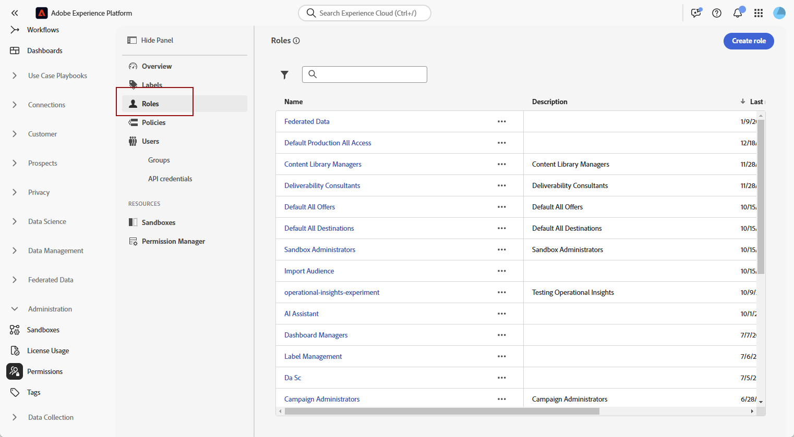

# Åtkomst till sammansatt målgrupp {#feature-access}

## Hantera åtkomst till sandlådor {#access-sandboxes}

När du köper tillägget Federated Audience Composition skapas en produktprofil för varje aktiv sandlåda vid den tidpunkten. Den här produktprofilen skapas i Admin Console under **Adobe Experience Platform** -produktkortet och följer den här namnkonventionen: `ACP_FAC - <<SandboxName>> - admin.` Om du vill få åtkomst till Federated Audience Composition för en viss sandlåda måste användare läggas till i produktprofilen som skapats för den sandlådan.

Om till exempel en ny sandlåda med namnet &quot;fac-test&quot; aktiveras skapas en motsvarande produktprofil, &quot;ACP_FAC - fac-test - admin&quot;. För att få åtkomst till Federated Audience Composition med den här sandlådan måste användare läggas till i den här produktprofilen.

## Hantera åtkomst till sammanställning av federerad publik

>[!AVAILABILITY]
>
>Behörigheter är tillgängliga som en del av mars-utgåvan.

Om du vill få åtkomst till **Federated Audience Composition** måste du först se till att behörigheten **Hantera federerade data** tilldelas rätt roller. Dessa roller måste sedan tilldelas användare som behöver åtkomst till **Federated Audience Composition**.

Observera att det endast är administratörer som kan tilldela behörigheter.

1. Navigera till menyn **[!UICONTROL Permissions]**.

1. Välj den **[!UICONTROL Role]** du vill uppdatera på menyn **[!UICONTROL Roles]**.

   

1. Klicka på **[!UICONTROL Edit]** om du vill ändra rollens behörigheter.

   

1. Lägg till resursen **Federated Data** och välj sedan **[!UICONTROL Manage Federated Data]** i listrutan.

   

1. När du har gjort de nödvändiga ändringarna klickar du på **[!UICONTROL Save]**.

Alla användare som redan är tilldelade den här rollen får sina behörigheter automatiskt uppdaterade och tillgång till Federated Audience Composition.

Så här tilldelar du rollen till nya användare:

1. Navigera till fliken **[!UICONTROL Users]** på din rollkontrollpanel och klicka på **[!UICONTROL Add Users]**.

   

1. Ange användarens namn eller e-postadress eller välj i listan över tillgängliga. Klicka på **[!UICONTROL Save]** när du är klar.

Användaren får sedan ett e-postmeddelande med instruktioner om hur man kommer åt instansen. Om användaren inte har skapats tidigare, se [den här dokumentationen](https://experienceleague.adobe.com/en/docs/experience-platform/access-control/abac/permissions-ui/users).
