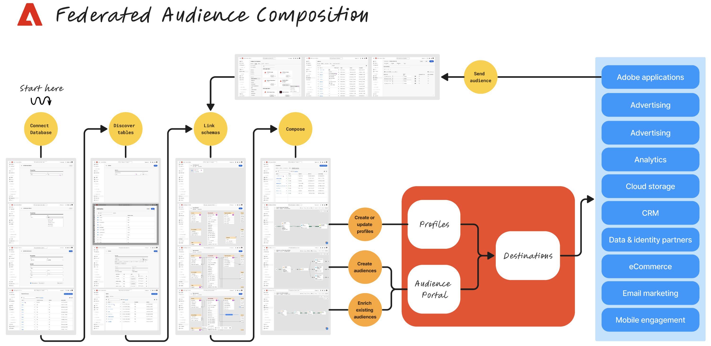

# Kom igång med Federated Audience Composition {#gs-fac}

Federated Audience Composition Composition är ett Adobe Real-time Customer Data Platform- och Adobe Journey Optimizer-tillägg som gör det möjligt för kunden att skapa och berika målgrupper från tredjeparts datalager och importera målgrupperna till Adobe Experience Platform.

Adobe Experience Platform Federated Audience Composition erbjuder en enkel och kraftfull lösning för att ansluta ert datalager direkt till Adobe Real-time Customer Data Platform och/eller Adobe Journey Optimizer och utföra frågor i datalagrets tabeller.

Adobe Federated Audience Composition hjälper Adobe Experience Platform-appanvändare att få tillgång till sina kunddata som lagras i datalagret och molnlagringsplattformar som Amazon Redshift, Azure synapse Analytics med flera. Kunddata kan lagras i flera datalager och är nu tillgängliga direkt, utan replikering. Plattformar som stöds listas på [den här sidan](../connections/federated-db.md#supported-db).

## Användningsfall {#rn-uc}

Med ett marknadsföringsvänligt användargränssnitt kan du skapa segmentregler som söker efter en lista på de användare som är kvalificerade för ett visst segment som behövs för marknadsföringskampanjer, få tillgång till befintliga målgrupper i lagerstället för aktivering eller berika Adobe Experience Platform-målgrupper med ytterligare datapunkter som finns i lagerstället.

I den här versionen finns två användningsexempel: Målgruppssegmentering och målgruppsberikning. Profilberikning kommer att finnas i en framtida version.

{zoomable="yes"}

## Viktiga steg {#gs-steps}

Med Adobe Federated Audience Composition kan ni skapa och uppdatera Adobe Experience Platform-målgrupper direkt från er databas, utan att behöva lägga in något i den.

{zoomable="yes"}

Viktiga steg:

* **Konfiguration**

   1. Koppla samman Adobe Experience Platform och företagets datalager.
Följande databaser stöds: Snowflake, Google Big Query, Azure synapse och Redshift.
Läs mer på [den här sidan](../connections/federated-db.md)
   1. Skapa scheman för att välja vilka data som ska vara tillgängliga från användargränssnittet.
Läs mer på [den här sidan](../customer/schemas.md)
   1. Skapa länkar för din datamodell.
Läs mer på [den här sidan](../data-management/gs-models.md)

* **Disponera målgrupper**

   1. Designa och kör montage för att skapa målgrupper.
Läs mer på [den här sidan](../compositions/gs-compositions.md)
   1. Uppdatera eller återanvänd befintliga målgrupper via Adobe Experience Platform Audience Portal och Destinations.
Läs mer på [den här sidan](../connections/destinations.md)

## Vanliga frågor {#faq}

Nedan följer en lista med vanliga frågor och svar om Federated Audience Composition. Det finns även globala frågor och svar för Adobe Experience Platform segmenteringstjänst på [den här sidan](https://experienceleague.adobe.com/en/docs/experience-platform/segmentation/faq){target="_blank"}.

+++Vilka behörigheter krävs för att få åtkomst till den sammansatta publikationen?

Det finns inga specifika behörigheter för Federated Audience Composition. Den enda förutsättningen för att få tillgång till den här funktionen är att du har köpt tillägget Federated Audience Composition.

+++

+++Vilka molnlager stöds?

I den här versionen är Federated Audience Composition kompatibelt med:

* Amazon Redshift
* Azure synapse
* Google Big Query
* Snowflake
* Vertica Analytics

+++

+++Kan flera datalager frågas i samma disposition?

Ja, flera lagerställen kan läsas i samma disposition och kombinera data från flera källor.  Vanligtvis är varje [dispositionsaktivitet](../compositions/orchestrate-activities.md) (Fråga, Uppgradering, Dela osv.) kör en eller flera SQL-satser beroende på aktivitetskonfigurationen, måldatabaserna (det kan finnas flera fall av federerad dataåtkomst) och utdata för en eller flera arbetstabeller med resultatet av körningen. Dessa arbetsblad används som indata för efterföljande aktiviteter.

+++

+++ Kan jag få åtkomst till hela min databas med Federated Audience Composition?

Nej, det är upp till dig att konfigurera åtkomst till en dedikerad eller delad databas/schema. Vi rekommenderar att du endast skapar ett dedikerat schema för sammanställning av federerad publik och kopierar/delar affärsdata.
+++

+++Har jag åtkomst till alla tabeller i det dedikerade schemat?

Ja, när du väl har anslutit kan Federated Audience Composition användas för att identifiera alla tabeller baserat på de initiala rättigheterna som har definierats. Sedan kan du använda den visuella schemaredigeraren för att:

* Identifiera kolumner och primärnycklar från dina tabeller
* Skapa egna etiketter till de tabellerna
* Skapa egna etiketter för varje kolumn
* Dölj onödiga kolumner
* Spara tabellbeskrivningen
+++

+++Finns det någon tillfällig lagring i Federated Audience Composition?

Nej, sammanställning av federerad publik lagrar bara metadata (schemabeskrivningar). Inga kunddata överförs. Exportflödet för målgruppen görs direkt från Adobe Experience Platform Audience Portal (via [Destination](../connections/destinations.md)) till kunddatabasen. Flödet för skapande och uppdatering görs direkt från datalagrets databas till Adobe Experience Platform Audience Portal.

+++

+++Lagrar Federated Audience Composition en fysisk kopia av listan över personer som ska skickas till system längre fram i kedjan?

Federated Audience Composition bevarar inte en fysisk kopia av data. Frekvensen konfigureras i kompositionen för att definiera hur ofta dessa data ska uppdateras. De resulterande målgruppsdata lagras inte längre av Adobe Experience Platform än vad som krävs av kundens användningsfall eller åtgärd.

Exempel:

* Om ni har en målgruppssegmentering skapas målgruppen i ert lager, och ni kan använda Federated Audience Composition för ytterligare dispositionsuppgifter och dataändringar innan ni publicerar målgruppen och tillhörande attribut via Adobe Experience Platform Audience Portal. Målgruppsdefinitionen och tillhörande attribut kommer till Adobe Experience Platform.
Observera att dagens data för externt genererade målgrupper upphör att gälla 30 dagar. När dessa data förfaller minskar mängden överflödiga data som lagras inom en organisation. När förfalloperioden för data har passerat är den associerade datauppsättningen fortfarande synlig i datamängdslagret, men du kan inte aktivera målgruppen och profilantalet visas som noll. Läs mer i [Adobe Experience Platform-dokumentation](https://experienceleague.adobe.com/en/docs/experience-platform/segmentation/faq#how-long-do-externally-generated-audiences-last-for){target="_blank"}.

* För Audience Enrichment är utgångspunkten en befintlig Adobe Experience Platform-publik. Här kan du titta på två scenarier:
   1. Hämta ytterligare målgruppsnyttolastattribut från det externa datalagret: i det här fallet kommer de ytterligare attribut som läggs till att ingå i den här målgruppsdefinitionen. Utgångsdatumet för externt genererade målgrupper är densamma som beskrivs ovan, 30 dagar.
   1. Förfina den befintliga Adobe Experience Platform-målgruppen baserat på ytterligare attribut som finns i ert datalager. Du har till exempel en publik med kunder som har visat intresse för en viss produkt på webbplatsen de senaste två månaderna. Nu vill ni ta den här målgruppen och segmentera den ytterligare med Federated Audience Composition för att bara inkludera kunder som har ett högt kreditbetyg. Kreditpoängen anses vara känsliga och enskilda kreditpoängsdatapunkter kopieras inte från datalagret.
+++

+++Om data för målgruppssegmentering och målgruppsberikning inte bevaras, hur lagras de tillfälligt?

De resulterande målgruppsdata bevaras inte i oändlighet i Adobe Experience Platform eller i Federated Audience Composition. Den kommer inte att sparas längre än vad som krävs för ditt användningsfall. De målgruppsattribut som ingår i målgruppsnyttolasten finns bara kvar som en del av målgruppsdefinitionen. Varaktigheten baseras på TTL för alla målgrupper. Standardvärdet är 30 dagar.

+++

+++Kan jag ta bort en anpassad överförd publik?

Du kan ta bort målgrupper som inte används i efterföljande aktiveringar direkt i målportalen genom att välja Ta bort på Åtgärder-menyn. Läs mer i [Adobe Experience Platform-dokumentation](https://experienceleague.adobe.com/en/docs/experience-platform/segmentation/faq#how-do-i-put-an-audience-in-the-deleted-state){target="_blank"}.

+++

+++Om jag kombinerar data från flera källor, hur sammanfogar vi dessa data? Använder vi identitetstjänsten?

Nej, identitetstjänsten används inte under en disposition. Data mellan olika källor som används i kompositionen sammanfogas med användardefinierad logik (som uttrycks i den underliggande modellen), t.ex. CRM-ID, användarkontonummer osv. Du måste välja den identitet som används som identifierare i målgruppen för val i ditt datalager. På en målgrupp från Federated Audience Composition måste du identifiera identitetsnamnutrymmet för identiteten i den resulterande datauppsättningen.

+++

<!--
+++If I want to combine federated data with datasets that live in Adobe Experience Platform, how is this done?

Likewise, the Identity Service is not being leveraged in this scenario either. The data model underpinning a composition needs to express how the data warehouse data and the audience to be enriched are related. e.g. assume an existing audience in Adobe Experience Platform contains several attributes, among which is the CRM ID. Assume transactional data is in the data warehouse containing purchases with various attributes, including the CRM ID of the purchaser. The end-user would have to specify that the CRM ID for both objects is used to stitch the two objects together.

+++
-->

## Läs mer {#learn}

<!-- Workflow + Workflow activities-->

>[!CONTEXTUALHELP]
>id="dc_workflow_settings_execution"
>title="Körningsinställningar"
>abstract="I det här avsnittet kan du konfigurera inställningar som är relaterade till arbetsflödets körning, t.ex. antalet dagar som kompositionshistoriken sparas."

>[!CONTEXTUALHELP]
>id="dc_orchestration_query_enrichment_noneditable"
>title="Aktiviteten är inte redigerbar"
>abstract="När en **fråga** eller en **berikning**-aktivitet har konfigurerats med ytterligare data i konsolen, beaktas data för berikning och skickas till den utgående övergången, men den kan inte redigeras."

<!-- Create a link -->

>[!CONTEXTUALHELP]
>id="dc_federated_database_create_link"
>title="Skapa en länk"
>abstract="Definiera länkinställningarna."
